# <center>UI interfaces for ABF averaging and subsequent analysis

## Table of Contents
  - [Initial Set Up](#initial-set-up)
  - [Setting up](#setting-up) 
  - [Initial Guide](#initial-guide)
  - [Fitting data using the UI interface](#fitting-data-using-the-ui-interface)
  - [Clickable App to launch R based UI](#clickable-app-to-launch-R-based-UI)


## Initial Set Up

All analysis was performed using the R graphical user interface (GUI) and tested on R version 4.4.1 "Race for Your Life".

- [`R` Statistical Software](https://www.R-project.org/)
- [`XQuartz`](https://www.xquartz.org/) required for graphical output on MacOS
- [`Sublime text`](https://www.sublimetext.com/) or, if you prefer, simply use the the default R text editor
- This code uses the package `Rcpp` to compile  C++ code.

  On `MacOS`, `R` requires the Xcode Command Line Tools to compile C++ code. To install the tools, open the Terminal and run:
  
  ```bash
  xcode-select --install
  ```
  On a `Windows` PC,  `R` requires `Rtools` instead. The latest version of [`Rtools`](https://cran.r-project.org/bin/windows/Rtools/). After installing Rtools, ensure that the installation path is added to your system's environment variables if `R` does not detect it automatically.

  On Linux (Debian/Ubuntu), R requires development tools to compile packages from source:
  ```bash
  sudo apt-get update
  sudo apt-get install build-essential
  ```

At the least, both `R` and `XQuartz` are essential to install for this code to work.

### Setting up

Download the code in this directory using the green <span style="background-color:#00FF00; color:white; padding:4px 8px; border-radius:6px; font-family:monospace; display: inline-flex; align-items: center;"> &lt;&gt; Code <span style="margin-left: 4px;">&#9660;</span> </span>
dropdown menu followed by `Download Zip`

Unpack and create directory e.g. `/Users/UserName/Documents/Rfits` replacing `UserName` with your actual `UserName` (!). 

In order for the provided R code to work, it is necessary to load various packages within the R environment.

The following code should be executed in R prior to running any of the analysis functions. 
It checks if the required packages are present and, if they are not, it will install them.

Any code preceded by # is `commented out` and is provided in `*.R` files for instructional/informational purposes.

-----------------------------------------------------------------------------------------------
-----------------------------------------------------------------------------------------------

 ### Average and save ABF data using the UI interface app

 The standalone `UI`s `analyseABFtk()` or `analyseABFshiny()` can average and create 'csv' output from raw `ABF` files.
 
 The following instructions are provided for using the tk interface i.e. by running the function `analyseABFtk()`.

 In addition to the tk interface launched using `analyseABFtk()`, an identical analysis procedure can be performed using the Shiny-based UI by launching `analyseABFshiny()`.

 The steps, options, and workflow are the same for both interfaces.

 The 'UI' is designed to normalise selected traces to a chosen baseline period then average and export output to a 'csv' file.
   
 a. **Launch UI**  
 
 Click on the 'ABF average' icon

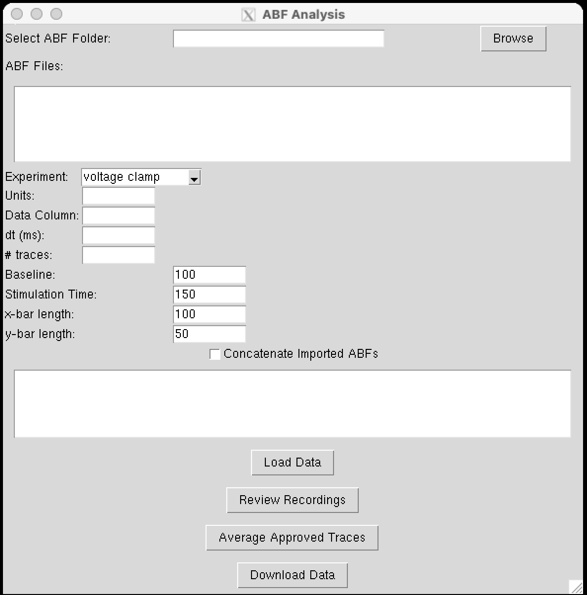 

 Some options in the settings menu are intentionally blank. These values will autopopulate from the first uploaded file.
 
 b. **Upload ABF files**  

 In the UI, select the ABF folder by pressing **Browse**. At this point, the values for **Units**, **Data Column**, **dt (ms)**, and **# traces** will appear.  

 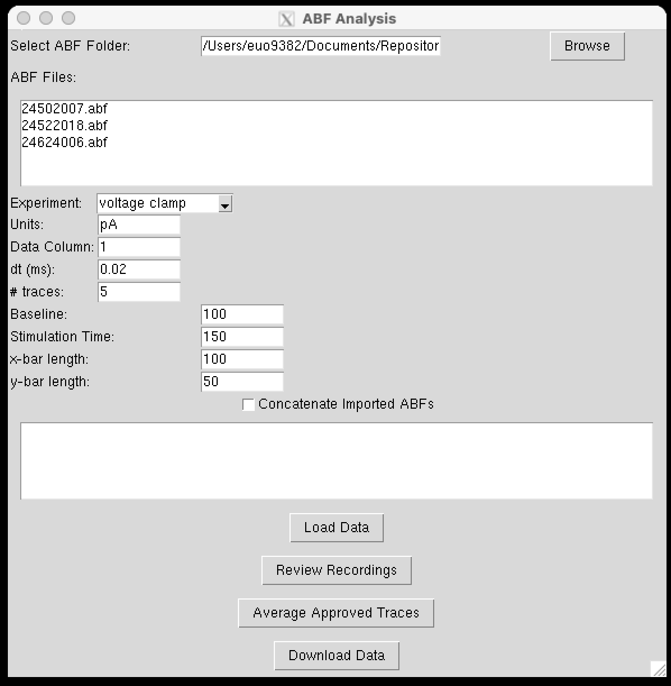 

 Any files present in the chosen directory will appear in the **ABF Files** window. On macOS, use the Option key to highlight the required files to upload by pressing the **Load data** button. 

 A new panel will open. At the top, some basic metadata from the first loaded ABF file will appear. Below this, the first 10 rows of the first recorded trace are shown to allow you to determine which column contains the response (in this case column 1).

 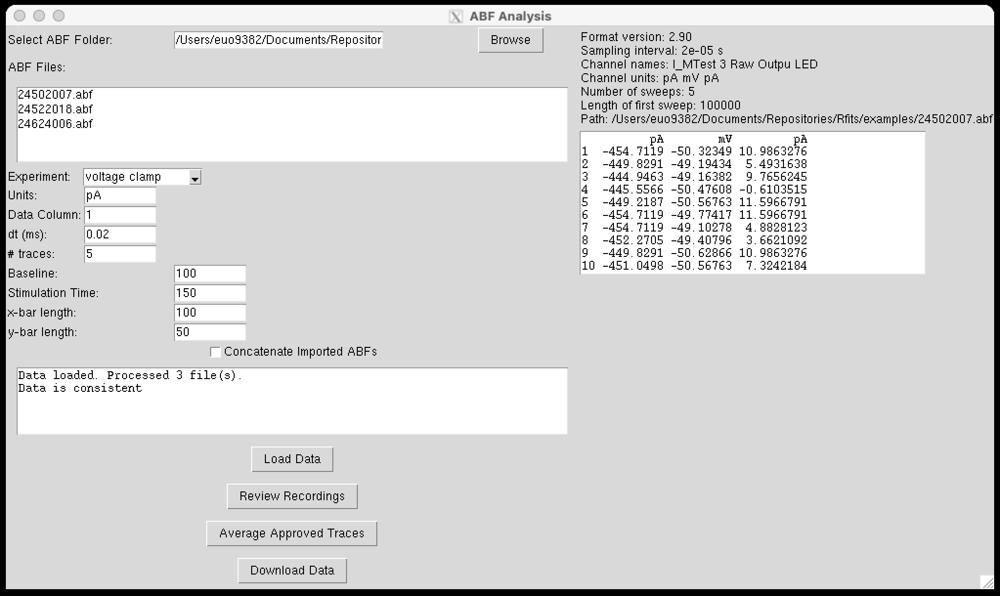

 In addition, the window below the main menu on the left panel gives a message:
 
 ```
 Data loaded. Processed 3 file(s).
 Data is consistent
 ```
 
 The UI checks that all files have the same metadata settings (sample rate, recording mode). Only files that are consistent can be analysed in the same session.  

 > **Note:** Ensure that all files analysed in batches are recorded with the same amplifier sample rates. The UI grabs these settings from the header of the first uploaded ABF file and assumes they are the same for all subsequent ABFs (data is consistent). An error will result if this condition is not met.
 
 c. **Concatenate imported ABFs**  

 The default is unchecked. If unchecked, only traces within a given ABF can be averaged together (when each ABF represents an independent condition). In this case, the **# traces** displays the number of traces in each ABF file (here 5).  

 If this box is checked and **Load Data** is pressed, the traces from all selected ABF files are placed into one 'master' ABF file. The **# traces** will be updated to 15 (3 'ABF' files each containing 5 traces). This mode is intended when averaging across 'ABF' files is desired.  
 
 d. **Review Recordings**  

 Click the **Review Recordings** button. If **Concatenate imported ABFs** is not checked:
 
 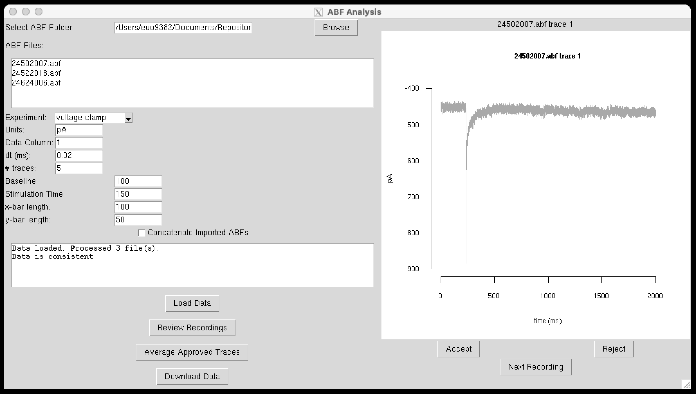
 
 The right-hand panel shows the first trace from the first selected ABF file. Traces can be accepted or rejected. If accepted, they are stored for subsequent averaging. When all traces for that ABF file are reviewed, the left-hand window displays:
 
 ```
 24502007.abf complete
 ```
    
 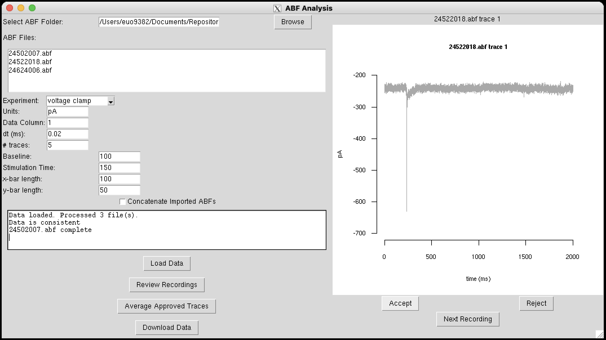  
 The UI then moves on to the first trace of the next ABF file. When all ABF files have been processed, the status window displays:
 
 ```
 Data loaded. Processed 3 file(s).
 Data is consistent
 24502007.abf complete
 24522018.abf complete
 24624006.abf complete
 ```
 
 e. **Average Approved Recordings**  

 Click the **Average Approved Recordings** button. The first average appears; use the **Next** button to cycle through subsequent averages.  

 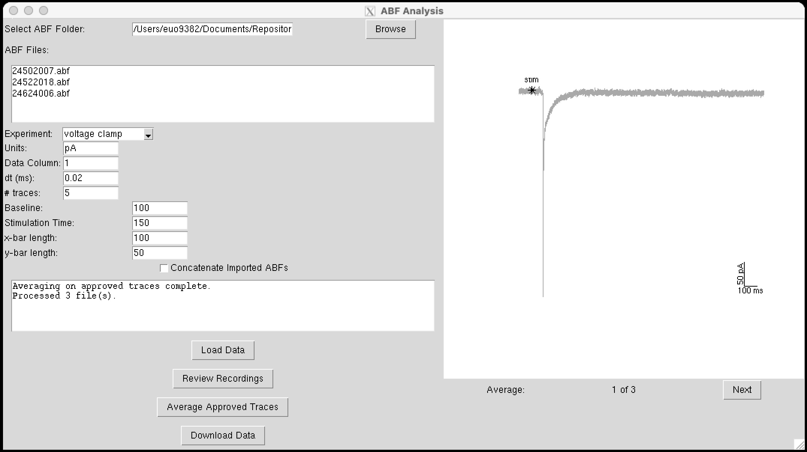  

 The chosen stimulation time is marked with an asterisk, `*`. In this example, the stimulation time must be corrected in the right-hand setting: choose a suitable value (here 230 ms) and press **Average Approved Recordings** again. The `*` should appear just before the rising time of the response. Ensure the baseline is chosen relative to the stimulation.
 
 Now choose a suitable baseline (e.g. 200 ms) and click **Average Approved Recordings** for a final time. The displayed average should now have a 200 ms baseline and an `*` at the stimulation time.

 Cycle through all averages using **Next**.  

 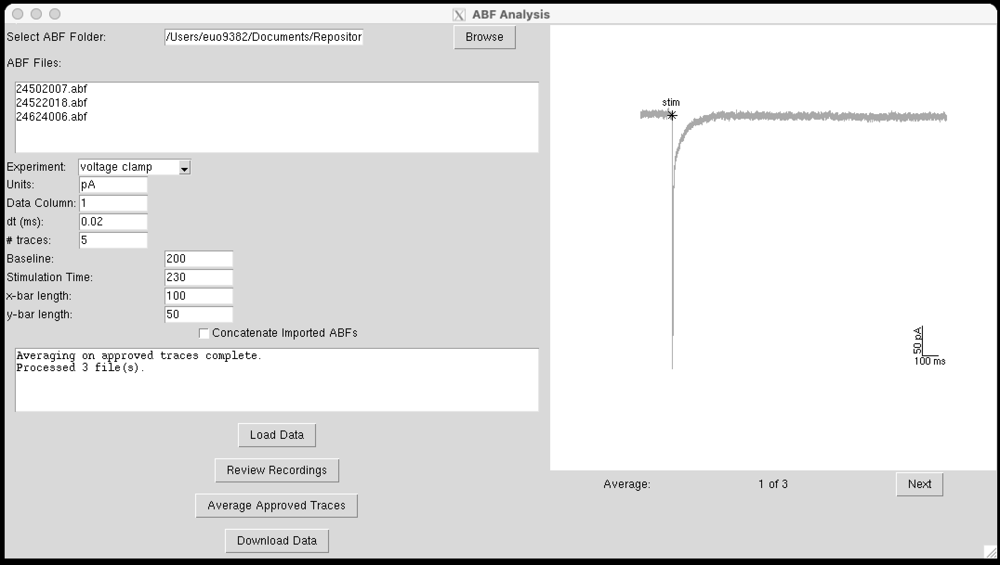
 
 f. **Download Data**  

 When satisfied that baseline and stimulation are correctly specified, click the **Download Data** button to export the traces to a `csv` spreadsheet. A dialog box appears allowing you to choose the name and location of the `csv` file.

 As stated the steps, options, and workflow are the same for both interfaces. Some equivalent images obtained from the shiny `UI` launched by `analyseABFshiny()` are:

 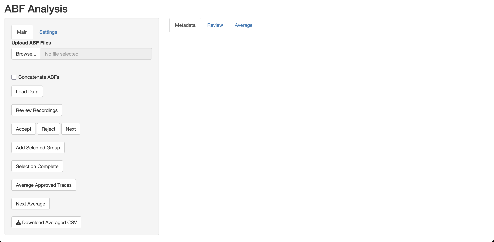

 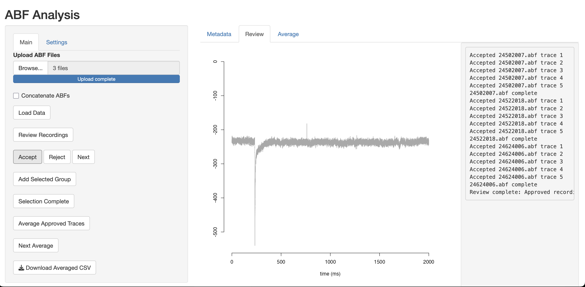

 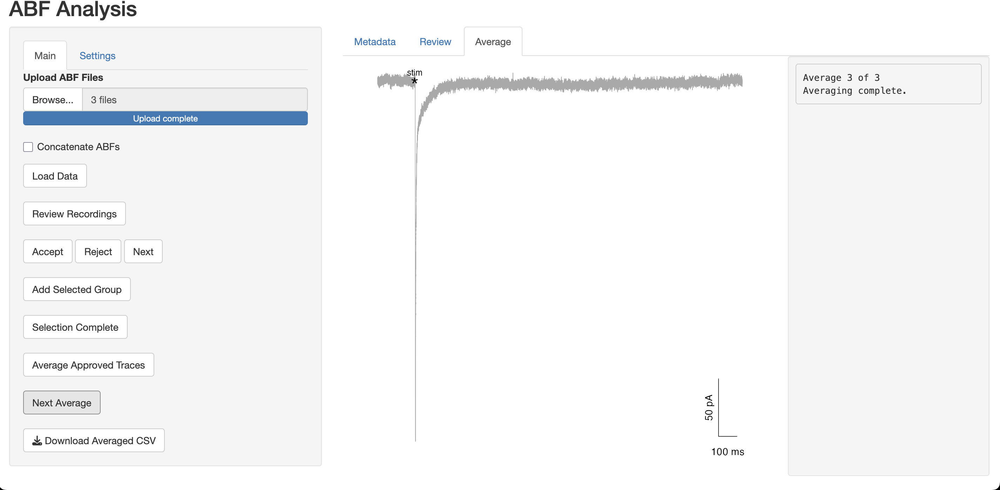

  
 ### Fitting data using the UI interface

 The following instructions are provided for using the tk interface i.e. by running the function `analysePSCtk()`.

 In addition to the tk interface launched using `analysePSCtk()`, an identical analysis procedure can be performed using the Shiny-based UI by launching `analysePSCshiny()`.

 

  a. **Launch the User Interface**  

  Click on the 'PSC analysis' icon

  The `UI` should open:

  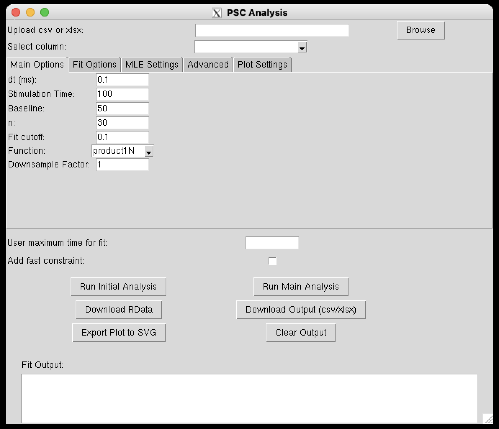 
 
  b. **Upload `csv` or `xlsx`**  

  In the `UI`, click the **`Browse`** button and select your file (e.g. `examples/data.csv`).

  c. **Select column**  

  In the `UI`, use the dropdown menu **`Select column`** to select the trace to analyse (in this example choose V1).

  d. **Set options in `Main Options` dropdown menu** (all selections in the `ui`)
 
  - **`dt`**: the trace in this example was sampled at 0.1 ms (this is the default setting of 10 KHz sampling)
  - **`Stimulation time`**: stimulation time was 150 ms
  - **`Baseline`**: set baseline to some reasonable value (to reproduce this example use 50 ms); the only requirement is that baseline is less than or equal to the  stimulation time 
  - **`n`**: number of fit attempts (30 is default) 
  - **`Fit cutoff`**: default setting 0.1 of the peak response 
  - **`Function`**: default is set to `product1N` to fit one response. For this example choose `product2N`
  - **`Downsample Factor`**: allows the user to downsample the data. This value must be greater than or equal to 1 where 1 indicates no downsampling. Fitting times are directly related to the time window of trace being fitted and the sampling rate, so downsampling can greatly increase fitting speed. However, care should be taken when downsampling a signal, as reducing the sampling rate may compromise the resolution of fast events or distort the shape of rapid transients critical to accurate fitting. It is advisable to verify the integrity of downsampled traces by visual inspection to ensure that key features of the response are preserved.

    e. **Run Initial Analysis**  

    In the `UI`, click the **`Run Initial Analysis`** button.

    A plot will appear with horizontal and vertical lines showing the time at which the response falls to the `Fit cutoff` level (e.g. ~508.4 ms).

    Enter `510` in the **`User maximum time for fit`** input box in the `UI`. This defines the end point of the time window over which the fitting will be performed for       the displayed trace.

    The `UI` output now looks like this:  

    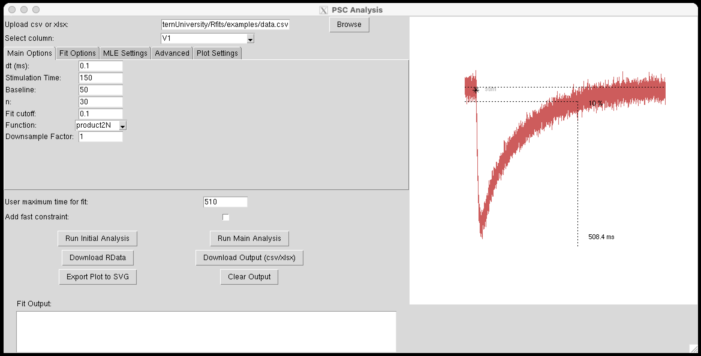

    f. **Run Main Analysis**  

    Click the **`Run Main Analysis`** button to start the fitting procedure.

    After a few seconds, the graph will update to show the original response, two fitted responses, and the numerical results in the **`Fit Output`** window.

    The updated output looks like this:
   
    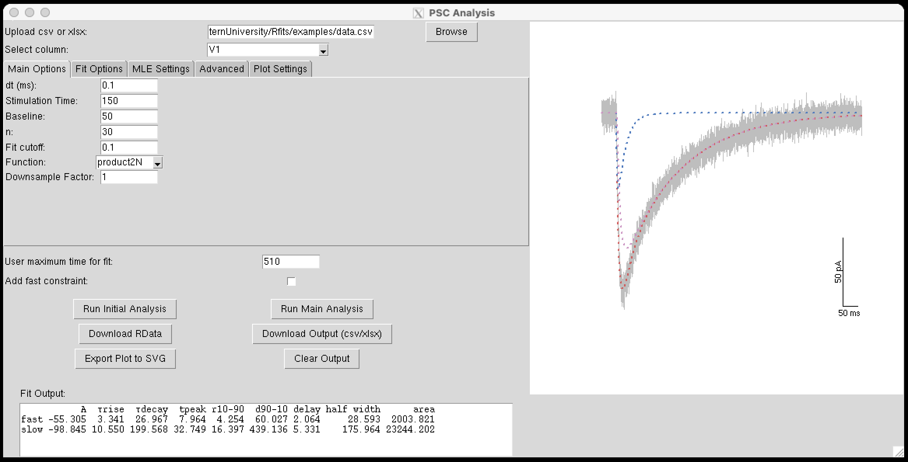

    g. **Download RData**  

    Click the **`Download RData`** button to save all fit results in a `.RData` file.

    This allows the user to download the entire results of the fitting process into a format that can be read by R (*.Rdata).

    This includes all the fits (in this case 30 as denoted by n above) and the resultant best fit with the lowest gof  (since all fits are to the same number of points to be fitted (same response) and are fitted with the same equations)

    h. **Download output (csv/xlsx)**  

    Click the **`Download output (csv/xlsx)`** button to open the download box, enter a `File name` and hit `save`.  

   The `xlsx` file includes 4 sheets:  
    - output table  
    - raw + fitted traces  
    - AIC/BIC criteria values 
    - metadata (all dropdown values)
  
  In this scenario a single excel file is generated with 4 separate sheets containing the main output, the raw response and fitterd traces, the associated fit  criterion (both AIC and BIC are given and the metadata associated with the fit (i.e. all the selected values in the 4 dropdown menus to determine the fitting options).

  This file should be all that is required to pool across experiments, select a single example and allow the reproduciblity (as all metadata is stored).

  i. **Export Plot to SVG**  

  In the `UI`, click the **`Export Plot to SVG`** button.

  The exported plot looks like this:
     
  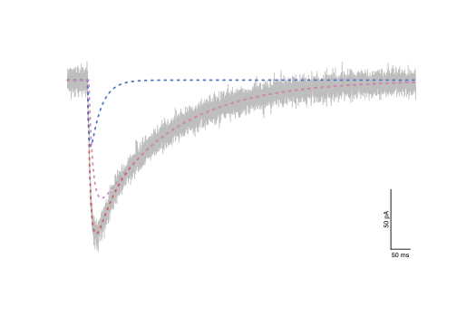

  j. **Clear Output** _(optional)_  

  Click the **`Clear Output`** button to reset the plots and outputs to the `Run Initial Analysis` stage of analysis

  To analyse the next trace in sequence chose a new column of data to analyse and (if analysing data with same settings i.e. otherwise step c remains unchanged) repeat steps c-i.

  As stated the steps, options, and workflow are the same for both interfaces. The equivalent images obtained from the shiny `UI` launched by `analysePSCshiny()` are:

  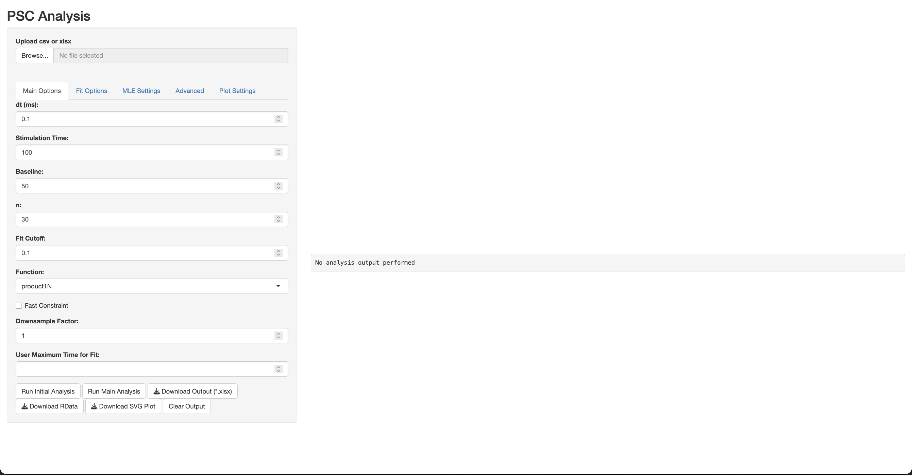

  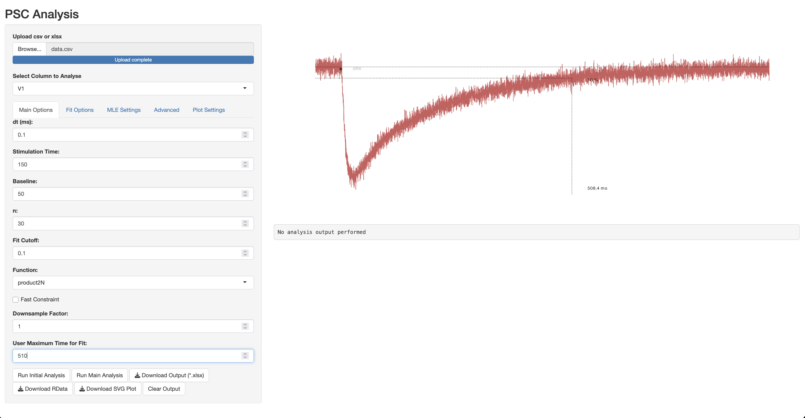

  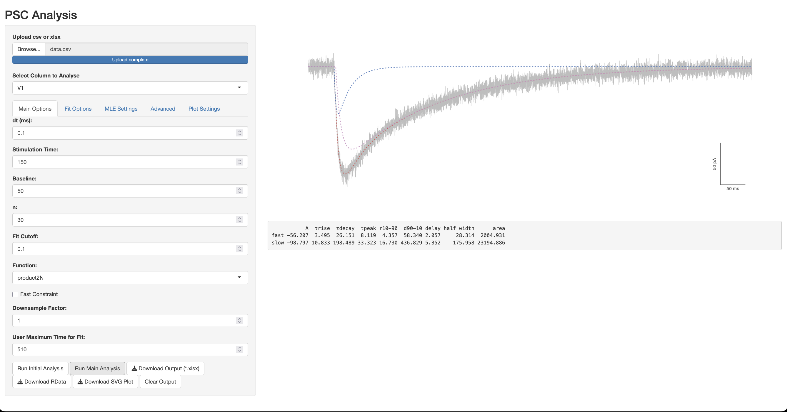

  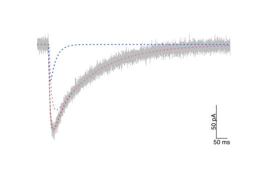
   


### Clickable App to launch R based UI

The following is a description of how a clickable apps for the provided code was created.

a. Create the launcher file with nano:

    nano ~/Desktop/launch_psc_analysis.command

Paste the following into the editor:

    #!/bin/zsh
    # launch PSC Analysis via Rscript so the tcltk GUI stays alive
    RSCRIPT="/Library/Frameworks/R.framework/Resources/bin/Rscript"

    "$RSCRIPT" --vanilla -e "
      # load/install packages
      load_required_packages <- function(pkgs) {
        new.pkgs <- setdiff(pkgs, rownames(installed.packages()))
        if (length(new.pkgs)) install.packages(new.pkgs)
        invisible(lapply(pkgs, library, character.only=TRUE))
      }
      load_required_packages(c(
        'dbscan','minpack.lm','Rcpp','robustbase',
        'shiny','signal','readABF','readxl',
        'tcltk','tkrplot','openxlsx'
      ))

      # source your GUI code
      source('~/Documents/Repositories/Rfits/nNLS functions.R')

      # launch the GUI (blocks until you close the window)
      analysePSCtk()
    "

Save and exit nano (`Ctrl+O` ↵, `Ctrl+X`).

b. Make the script executable:

    chmod +x ~/Desktop/launch_psc_analysis.command

c. Launch:

Double-click `launch_psc_analysis.command` on your Desktop  
• A Terminal window opens and runs Rscript  
• Your tcltk UI (`analysePSCtk()`) pops up and stays open  
• When you close the UI window, the R session exits automatically  

**Note:**  
Ensure your `nNLS functions.R` ends the UI function with:

    tkfocus(tt)
    tcltk::tkwait.window(tt)

    
	    
  Optionally, right-click > Get Info and set a custom icon.
  
