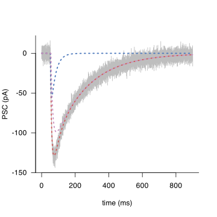
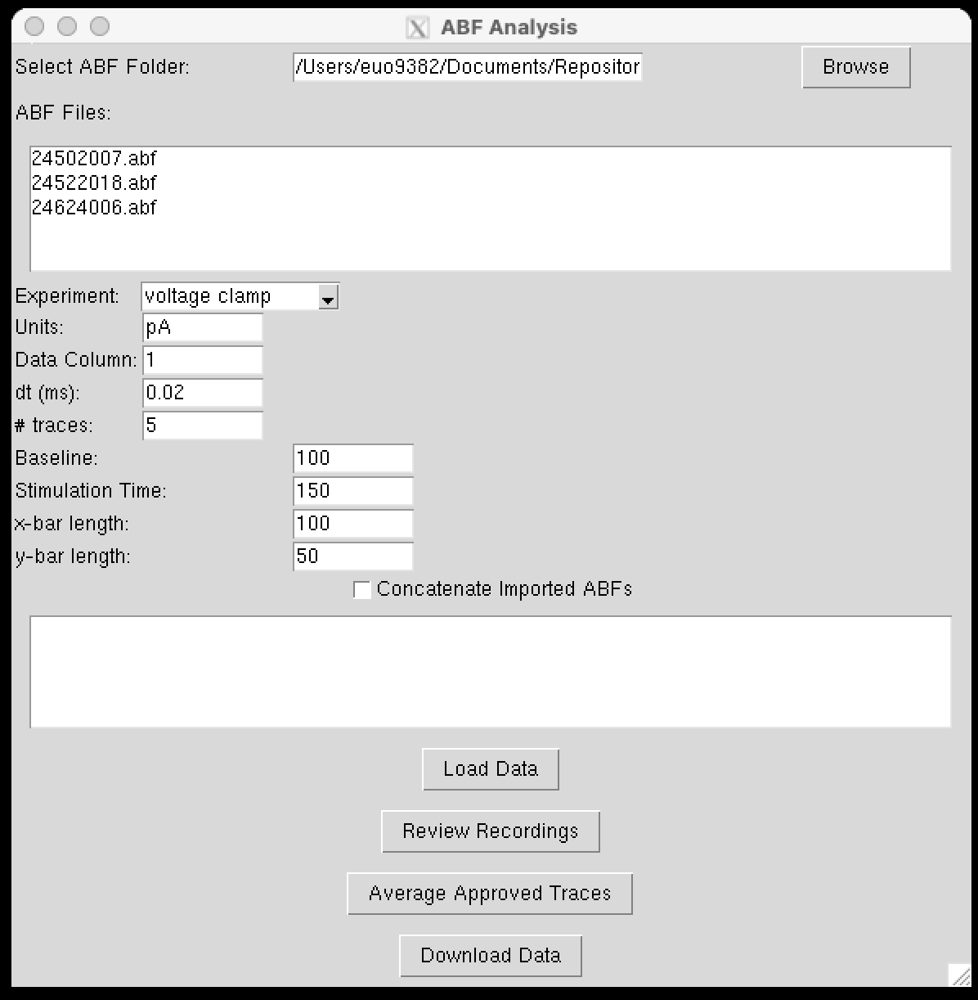
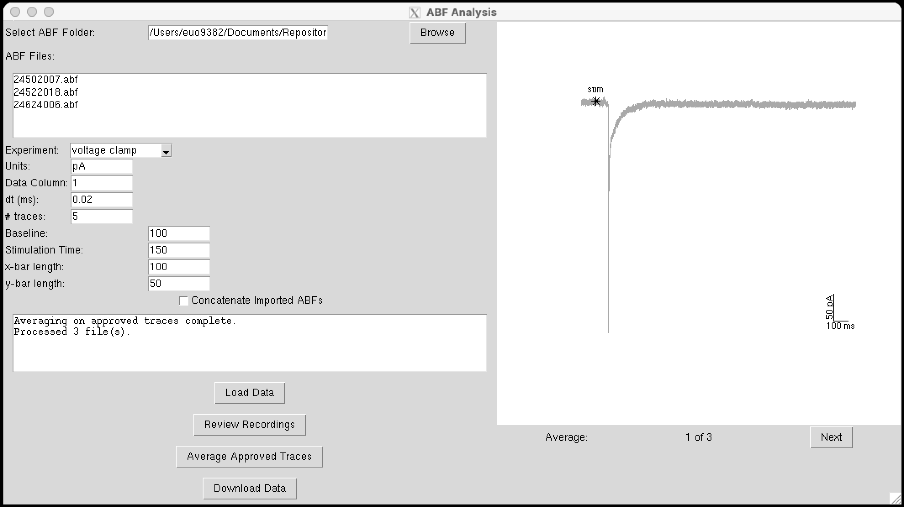
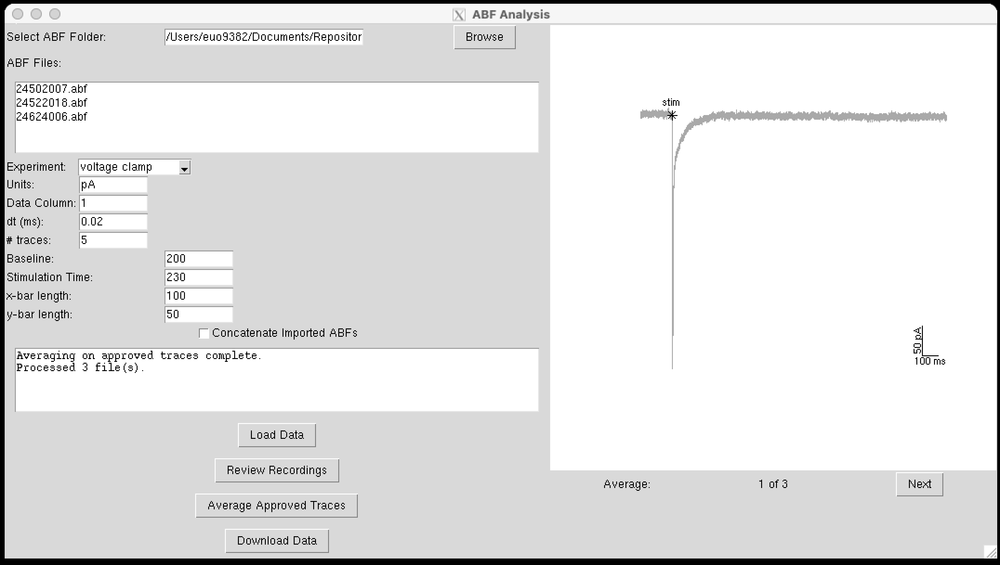
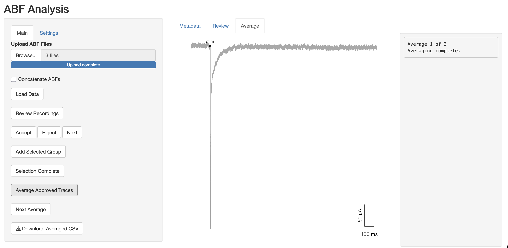
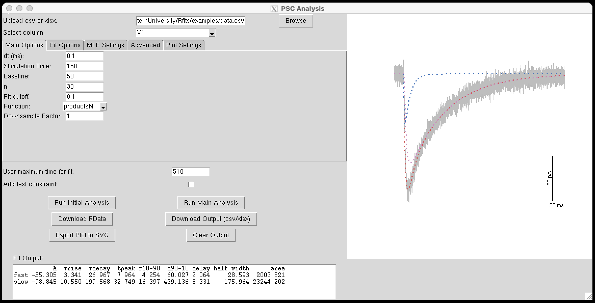
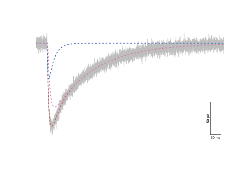
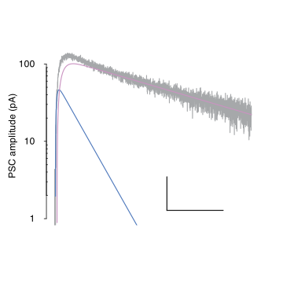

# <center>R code to perform non-linear squares fitting of functions used to describe signal waveforms 

## Table of Contents
- [Initial Set Up](#initial-set-up)
- [Setting up](#setting-up)
- [Known set-up issues](#known-set-up-issues)
- [Initial Guide](#initial-guide)
- [Step-by-Step Guide](#step-by-step-guide)
  - [Setting the environment](#setting-the-environment)
  - [Simulated example](#simulated-example)
  - [View data](#view-data)
  - [Load data](#load-data)
  - [View imported data](#view-imported-data)
  - [Analyse in RGui using analyse_PSC](#analyse-in-rgui-using-analyse_psc)
  - [Average and save ABF data using the UI interface](#average-and-save-abf-data-using-the-ui-interface)
  - [Fitting data using the UI interface](#fitting-data-using-the-ui-interface)
  - [Clickable App to launch R based UI](#clickable-app-to-launch-R-based-UI)
  - [Analysing an entire data set](#analysing-an-entire-data-set)
  - [Retrieving analysed data](#retrieving-analysed-data)
  - [Examining analysed data](#examining-analysed-data)
  - [Useful functions](#useful-functions)
  - [Output file structure](#output-file-structure)
- [Definitions and Formulae](#definitions-and-formulae)


## Initial Set Up

All analysis was performed using the R graphical user interface (GUI) and tested on R version 4.4.1 "Race for Your Life" through to 4.5.0 "How About a Twenty-Six".


- [`R` Statistical Software](https://www.R-project.org/)
- [`XQuartz`](https://www.xquartz.org/) required for graphical output on MacOS
- [`Sublime text`](https://www.sublimetext.com/) or, if you prefer, simply use the the default R text editor
- This code uses the package `Rcpp` to compile  C++ code.

  On `MacOS`, `R` requires the Xcode Command Line Tools to compile C++ code. To install the tools, open the Terminal and run:
  
  ```bash
  xcode-select --install
  ```
  On a `Windows` PC,  `R` requires `Rtools` instead. The latest version of [`Rtools`](https://cran.r-project.org/bin/windows/Rtools/). After installing Rtools, ensure that the installation path is added to your system's environment variables if `R` does not detect it automatically.

  On Linux (Debian/Ubuntu), R requires development tools to compile packages from source:
  ```bash
  sudo apt-get update
  sudo apt-get install build-essential
  ```

At the least, both `R` and `XQuartz` are essential to install for this code to work.

Note: the use of X11 (including tcltk) requires XQuartz (version 2.8.5 or later). 
Always re-install XQuartz when upgrading your macOS to a new major version. 


### Setting up

Only the R console was used for analysis. 

If you prefer to work with [`RStudio`](https://posit.co/products/open-source/rstudio/), why? 

The provided code should work in `RStudio` although this has not explicitly been tested. 

Download the code in this directory using the green <span style="background-color:#00FF00; color:white; padding:4px 8px; border-radius:6px; font-family:monospace; display: inline-flex; align-items: center;"> &lt;&gt; Code <span style="margin-left: 4px;">&#9660;</span> </span>
dropdown menu followed by `Download Zip`

Unpack and create directory e.g. `/Users/UserName/Documents/Rfits` replacing `UserName` with your actual `UserName` (!). 

In order for the provided R code to work, it is necessary to load various packages within the R environment.

The following code should be executed in R prior to running any of the analysis functions. 
It checks if the required packages are present and, if they are not, it will install them.

Any code preceded by # is `commented out` and is provided in `*.R` files for instructional/informational purposes.

### Known set-up issues

#### `XQuartz` Permissions & Environment Setup

If `XQuartz` (`X11`) fails due to permission resets (this routinely occurs on my `MacBook`, most likely as a result of my host institution altering permissions), any graphics in `R` will fail.

Reset `XQuartz` permission by following these steps:

a. Open `Terminal`

b. Create the /tmp/.X11-unix directory with sticky-world permissions

 ```bash
  sudo mkdir -p /tmp/.X11-unix
  sudo chmod 1777 /tmp/.X11-unix
 ```

c. Ensure no conflicting `X11` processes are running

 ```bash
  ps aux | grep X11
  sudo killall XQuartz
 ```

d. Restart `XQuartz`

 ```bash
  open -a XQuartz
 ```

e. Set the DISPLAY environment variable so X clients know where to connect

 ```bash
  export DISPLAY=:0
 ```

f. Allow connections from localhost (needed for calls from `R` / `tcltk`)

 ```bash
  xhost +localhost
 ```

g. Verify Security Settings for `Xquartz` GUI (optional):

Open XQuartz → Preferences → Security → check 'Allow connections from network clients'

h. Check the macOS Console for `XQuartz` errors (optional):

Open Console.app → filter for `XQuartz` → inspect any error messages

i. Test your configuration by launching a simple `X11` app

 ```bash
  xterm   # if an xterm window appears, your XQuartz setup is correct
 ```


-----------------------------------------------------------------------------------------------
-----------------------------------------------------------------------------------------------

## Initial Guide  
 
1. **Open R gui**
2. **Run this code once**
 ```R
 # Remove all objects from the environment
 rm(list = ls(all = TRUE))

 # Load and install necessary packages
 load_required_packages <- function(packages) {
    new.packages <- packages[!(packages %in% installed.packages()[, 'Package'])]
    if (length(new.packages)) install.packages(new.packages)
    invisible(lapply(packages, library, character.only = TRUE))
 }

 required.packages <- c('robustbase', 'minpack.lm', 'Rcpp', 'signal', 'writexl')
 load_required_packages(required.packages)
 ```
 Once this code is run, it should perform all necessary installations and load the necessary packages for the analysis

3. **load all necessary custom-written functions**

   **These functions are included in an `R` file named `nNLS functions.R`**


 ```R
 UserName <- 'YourUserName' # substitute your UserName here
 root_dir <- paste0('/Users/', UserName, '/Documents/Repositories/Rfits')
 path <- file.path(root_dir, 'nNLS functions.R')   
 source(path)
 ```

4. **Fitting example**

 The following code generates a noisy signal that comprises a single train of responses.

 The inter-event interval (or IEI) is 50 ms and the train comprises 3 responses (N).

 ```R
 dx <- 0.1
 stimulation_time <- 150
 baseline <- 150
 xmax <- 1000
 x <- seq(dx,xmax ,dx)
 N <- 3
 IEI <- 50

 # parameters to generate the fit A1, A2, A3, τ1, τ2 and a delay
 params1 <- c(-150, -250, -300, 1, 30, 4) 
 params1_ <- params1
 params1_[N+3] <- params1_[N+3] + stimulation_time

 std.dev <- 10

 ysignal <- product1N(params=params1_, x=x, N=N, IEI=IEI)
 y <- ysignal + rnorm(length(x),sd=std.dev)

 # quick plot if necessary
 # plot(x, y, type='l')

 # to analyse
 analyse_PSC(response=y, dt=0.1, n=30, N=3, IEI=50, stimulation_time=150, 
    baseline=150, func=product1N, return.output=FALSE) 
 ```
 
 When executing the code, graph will appear and a user prompt in `Rgui`:

 'Enter the upper limit for time to use in nFIT (e.g., 400 ms):'

 This represents the cut-off timepoint in the illustrated graph that curve fitting is performed.

 On entering a suitable variable (for example 600 ms), the initial graph will disappear and, after a short period of time, a new graph will appear with the best fit superimposed on the original signal. The output should look something like this:

 ```
 Enter the upper limit for time to use in nFIT (e.g., 400 ms): 
 330
         A1       A2       A3 τrise τdecay tpeak r10_90 d90_10 delay half_width    area1    area2    area3
 1 -150.324 -251.108 -301.651 0.923 29.975 3.314  1.576 65.874 4.019     24.473 5032.721 8406.901 10099.04
 
 Do you want to repeat with "fast constraint" turned on? 
 This constraint ensures the response with the fastest decay also has the fastest rise (y/n): 
 n
 ```
 The output gives: 

 -  $A_1$, $A_2$, $A_3$ the amplitudes of the (N=) 3 responses. 

    The amplitude of subsequent responses in a train are given relative to the previous ones i.e. $A_2$ is the difference between the peak of $A_2$ and decay of $A_1$ etc at the corresponding time point.  

 -  $τ_{rise}$ and $τ_{decay}$ of each underlying response. 

    The code assumed that the kinetics of the response is fixed and not affected by multiple trains of events.

 -  $t_{peak}$ represents the time to peak of the first response relative to the delay period.

 -  delay represents the time from the stimulation to the initial rise of the 1st fitted response.

 -  $r_{10-90}$ and $d_{90-10}$ are the 10-90% rise and 90-10% decays of the underlying response.

 -  $area_1$, $area_2$, $area_3$ represent the areas of the (N=) 3 responses. 

 Clearly, the total area of the fit is given by the sum of the areas i.e. $area_1$ + $area_2$ + $area_3$.

 The final graphical output should be:

 

-----------------------------------------------------------------------------------------------
-----------------------------------------------------------------------------------------------

## Step-by-Step Guide

The following code will simulate a set of data that is generated as the sum of underlying responses.

One response is fast with target decay of 30 ms; the other is slower with target decay of 200 ms.  

The simulation with create a dataset of 10 responses with modelled parameters. 

These responses with only differ by added gaussian noise.

 ### Setting the environment

 Run this code to setup the environment correctly:

 ```R
 # Remove all objects from the environment
 rm(list = ls(all = TRUE))

 # Load and install necessary packages
 load_required_packages <- function(packages) {
  new.packages <- packages[!(packages %in% installed.packages()[, 'Package'])]
  if (length(new.packages)) install.packages(new.packages)
  invisible(lapply(packages, library, character.only = TRUE))
 }

 required.packages <- c('robustbase', 'minpack.lm', 'Rcpp', 'signal', 'writexl')
 load_required_packages(required.packages)

 UserName <- 'YourUserName' # substitute your UserName here
 root_dir <- paste0('/Users/', UserName, '/Documents/Repositories/Rfits')
 path <- file.path(root_dir, 'nNLS functions.R')
 source(path)
 ```
 
 Once this code is run, it should perform all necessary installations and load the necessary packages for the analysis and will load all necessary custom-written functions


 ### Simulated example

 This code creates some example data and saves it in a given folder as an `*.xlsx` excel spreadsheet.
 
 This step is provided to generate some dummy data for the subsequent analysis and should be skipped if analysing raw data(!). 

 ```R
 # parameters for modelled response
 dx <- 0.1
 stim_time <- 150
 baseline <- 150

 xmax <- 1000
 x <- seq(dx,1000 ,dx)

 a1 <- 50; a2 = 100
 tau1.1<- 3; tau1.2 <- 30
 tau2.1 <- 10; tau2.2 <- 200
 d1 <- 2; d2 <- 5; 
 std.dev <- 5
 params = c(a=a1,b=tau1.1,c=tau1.2,d=d1+stim_time,e=a2,f=tau2.1,g=tau2.2,h=d2+stim_time)

 # create data
 set.seed(7)
 data <- sapply(1:10, function(ii){
 ysignal <- product2N(params,x)
 y <- ysignal + rnorm(length(x),sd=std.dev)
 y <- -y
 return(y)
 })

 # save as spreadsheeta

 # first create the examples directory in the toot directory (root_dir) if it doesn't exist
 dir.create(file.path(root_dir, 'examples'), showWarnings = FALSE)

 # save the data to a CSV file in the examples directory
 csv_file_path <- file.path(root_dir, 'examples', 'data.csv')
 write.csv(data, csv_file_path, row.names = FALSE)

 # save the data to an XLSX file
 xlsx_file_path <- file.path(root_dir, 'examples', 'data.xlsx')
 write_xlsx(as.data.frame(data), xlsx_file_path)
 ```

### View data

 The following code allows the user to view the created simulated data: 
 
 ```R
 # view data
 data[1:10, ]
 ```
 This should return the first 10 rows of each response of a data set (each response is represented by a column of data):

 ```
  [1,] -11.4362358  9.02156400  1.2879531   5.639612  4.6935805  4.9638106 -7.377987679 -5.3563476 -8.33502075 -4.4487588
  [2,]   5.9838584  5.41278827 -1.1184131  -1.700312 -4.3234950 -1.1168718 -4.359361312 -0.7504259 -0.47499372  2.5899406
  [3,]   3.4714626  1.60206229 -5.2290040  -8.368961  1.8007432 -4.4949810 -7.993212019 -1.2612013  1.18757220  0.9400377
  [4,]   2.0614648 -6.14163811 -5.1005224  -2.981428 -5.6017939  0.3309054  8.161036450 -5.6314810  5.84468869  0.1957501
  [5,]   4.8533667  4.36702941  0.5030759 -11.596560 -1.0816668  3.6825770  5.741051105 11.8945648  1.41371073  4.7739120
  [6,]   4.7363997  1.58622938  9.4749848  -2.455668 -4.9955200  1.8744517  0.051002636 -1.2766821  1.40202404 -0.7031591
  [7,]  -3.7406967 -9.07911146 -2.3372169   2.366092  2.4043474  7.0938247  0.002977297  7.6373625 -0.70608889  4.5962251
  [8,]   0.5847761  0.05113925  5.8944714   7.523724 -6.5179967 -3.0086500  2.125299548 -0.0365649 -0.01747515 -1.1345733
  [9,]  -0.7632881  2.82379599 -8.1796819   2.237984  0.9503212  7.2291688  6.313624658  1.7652820  4.99864101  1.2374311
 [10,] -10.9498905 -2.78843376  1.2559864   6.996717  0.9534663 -3.4337208  6.083794268 -3.7968008  4.40553708  6.2209127
 ```

 ### Load data

 The following code allows the user to load simulated data using the functions `load_data` or `load_data2`:
 
 If your data is in the form of a `*.csv` or `*.xlsx` you can use the provided functions `load_data` and `load_data2`, respectively to load it into a session of R (provided step 1 above is executed)

 ```R
 UserName <- 'YourUserName' # substitute your UserName here

 # create path to the working directory
 wd <- paste0('/Users/', UserName, '/Documents/Repositories/Rfits/examples') 

 # to load previously saved CSV file
 data1 <- load_data(wd=wd, name='data')

 # to load previously saved XLSX file:
 data2 <- load_data2(wd=wd, name='data')
 ```

 Note that function load_data2 imports all sheets in the excel file. `data2` is a list of these sheets which are labelled 'Sheet 1', 'Sheet 2' etc.
 
 In this example, the imported data XLSX only contains one sheet. 
 
 This can be accessed as `data2$'Sheet 1` etc.

 ### View imported data

 The following code allows the user to view the imported simulated data: 
 
 ```R
 # view first 10 rows of data imported from CSV file
 data1[1:10, ]

 # view first 10 rows of data imported from XLSX file
 data2$'Sheet1'[1:10,]
 ```
 
 Both return the first 10 rows of each response of a data set (each response is represented by a column of data):
 
 ```
             V1          V2         V3         V4         V5         V6           V7         V8          V9        V10
 1  -11.4362358  9.02156400  1.2879531   5.639612  4.6935805  4.9638106 -7.377987679 -5.3563476 -8.33502075 -4.4487588
 2    5.9838584  5.41278827 -1.1184131  -1.700312 -4.3234950 -1.1168718 -4.359361312 -0.7504259 -0.47499372  2.5899406
 3    3.4714626  1.60206229 -5.2290040  -8.368961  1.8007432 -4.4949810 -7.993212019 -1.2612013  1.18757220  0.9400377
 4    2.0614648 -6.14163811 -5.1005224  -2.981428 -5.6017939  0.3309054  8.161036450 -5.6314810  5.84468869  0.1957501
 5    4.8533667  4.36702941  0.5030759 -11.596560 -1.0816668  3.6825770  5.741051105 11.8945648  1.41371073  4.7739120
 6    4.7363997  1.58622938  9.4749848  -2.455668 -4.9955200  1.8744517  0.051002636 -1.2766821  1.40202404 -0.7031591
 7   -3.7406967 -9.07911146 -2.3372169   2.366092  2.4043474  7.0938247  0.002977297  7.6373625 -0.70608889  4.5962251
 8    0.5847761  0.05113925  5.8944714   7.523724 -6.5179967 -3.0086500  2.125299548 -0.0365649 -0.01747515 -1.1345733
 9   -0.7632881  2.82379599 -8.1796819   2.237984  0.9503212  7.2291688  6.313624658  1.7652820  4.99864101  1.2374311
 10 -10.9498905 -2.78843376  1.2559864   6.996717  0.9534663 -3.4337208  6.083794268 -3.7968008  4.40553708  6.2209127
 ```
 The output is identical to the originally created data (step 3). The only difference is the columns have been named V1, V2...

 ### Analyse in RGui using `analyse_PSC`

 The user can analyse a given column of data using the function `analyse_PSC`. 

 Each column of data represents a single PSC sampled at 10 KHz (sample interval was 0.1 ms).
 
 ```R
 # any response can be accessed data1[,1] or data1[,'V1'] where V1 is the appropriate column name 
 out1 <- analyse_PSC(response=data1[,1], dt=0.1, 
    func=product2N, stimulation_time=150, baseline=50) 
 ```
 Assuming the fit.limits input of analyse_PSC is not specified, a graph of the response will appear with a ablines to indicate the time point where the peak of the response has dropped 10% (default). 

 Use the indicated time as a reference for setting the time point at which fitting of the response will cease. 

 For example, entering '510' returns a graphical output of the fits and a table with values for amplitude, τrise, τdecay, tpeak, $r_{10–90}$, $d_{90–10}$, delay and area for the fast and slow (decay components).

 The user is then asked whether the fit should be repeated with a 'fast constraint' applied. 

 When 'y' is entered, the fit is repeated to ensure that responses with the fastest decay also have the faster rise time. 

 In this (and most cases), it is not necessary to repeat the fit since this requirement is already fulfilled. 

 The option to repeat is included for PSC fitting as most dual component PSCs will often fulfil this criterion and any arising fits that do not can simply be rejected if the user considers this a necessary constraint. 
 
 ```
 Enter the upper limit for time to use in nFIT (e.g., 400 ms): 
 510
           A1  τrise  τdecay  tpeak r10_90  d90_10 delay half_width     area1
 fast -55.305  3.341  26.967  7.964  4.254  60.027 2.064     28.593  2003.821
 slow -98.845 10.550 199.568 32.749 16.397 439.136 5.331    175.964 23244.202
 
 Do you want to repeat with "fast constraint" turned on? 
 This constraint ensures the response with the fastest decay also has the fastest rise (y/n): 
 n
 ```
 The generated output looks like this:

 


 By setting fit.limits to 510, the output is generated automatically without the need for any user input:

 ```R
 out1 <- analyse_PSC(response=data1[,1], dt=0.1, 
    func=product2N, stimulation_time=150, baseline=50, fit.limits=510) 
 ```
 By specifying a results list, in this case named out1, results can be retrieved from the generated list.

 For example, entering the command

 ```R
 out1$output
 ```

 returns the output table:

 ```
           A1  τrise  τdecay  tpeak r10_90  d90_10 delay     area1
 fast -55.305  3.341  26.967  7.964  4.254  60.027 2.064  2003.821
 slow -98.845 10.550 199.568 32.749 16.397 439.136 5.331 23244.202
 ```

 The fits can be redisplayed using function `fit_plot`:

 ```R
 fit_plot(traces=out1$traces, func=product2N, xlab='time (ms)', ylab='PSC (pA)', 
    lwd=1.2, height=5, width=5, save=FALSE)
 ```

 ### Average and save `ABF` data using the `UI` interface app

 The standalone `UI`s `analyseABFtk()` or `analyseABFshiny()` can average and create 'csv' output from raw `ABF` files.

 The following instructions are provided for using the tk interface i.e. by running the function `analyseABFtk()`.

 In addition to the tk interface launched using `analyseABFtk()`, an identical analysis procedure can be performed using the Shiny-based UI by launching `analyseABFshiny()`.

 The steps, options, and workflow are the same for both interfaces.

 The `UI` is designed to normalise selected traces to a chosen baseline period then average and export output to a `csv` file.
   
 a. **Launch UI**  
 
 ```R
 # open R from terminal:
 # open -n -a R
 
 rm(list = ls(all = TRUE))
 graphics.off()
 
 # load and install necessary packages
 load_required_packages <- function(packages) {
   new.packages <- packages[!(packages %in% installed.packages()[, 'Package'])]
   if (length(new.packages)) install.packages(new.packages)
   invisible(lapply(packages, library, character.only = TRUE))
 }
 
 required.packages <- c('dbscan', 'minpack.lm', 'Rcpp', 'robustbase',
   'shiny', 'signal', 'readABF', 'readxl', 'tcltk', 'tkrplot', 'openxlsx')
 load_required_packages(required.packages)

  # insert your username and repository path
  UserName <- 'YourUserName' # substitute your UserName here
  path_repository <- '/Documents/Repositories/Rfits'
  file_path <- paste0('/Users/', UserName, path_repository)
  source(paste0(file_path, '/nNLS functions.R'))

  # launch UI
  analyseABFtk()
 ```

 

 Some options in the settings menu are intentionally blank. These values will autopopulate from the first uploaded file.
 
 b. **Upload ABF files**  

 In the UI, select the ABF folder by pressing **Browse**. At this point, the values for **Units**, **Data Column**, **dt (ms)**, and **# traces** will appear.  

  

 Any files present in the chosen directory will appear in the **ABF Files** window. On macOS, use the Option key to highlight the required files to upload by pressing the **Load data** button. 

 A new panel will open. At the top, some basic metadata from the first loaded ABF file will appear. Below this, the first 10 rows of the first recorded trace are shown to allow you to determine which column contains the response (in this case column 1).

 

 In addition, the window below the main menu on the left panel gives a message:
 
 ```
 Data loaded. Processed 3 file(s).
 Data is consistent
 ```
 
 The UI checks that all files have the same metadata settings (sample rate, recording mode). Only files that are consistent can be analysed in the same session.  

 > **Note:** Ensure that all files analysed in batches are recorded with the same amplifier sample rates. The UI grabs these settings from the header of the first uploaded ABF file and assumes they are the same for all subsequent ABFs (data is consistent). An error will result if this condition is not met.
 
 c. **Concatenate imported ABFs**  

 The default is unchecked. If unchecked, only traces within a given ABF can be averaged together (when each ABF represents an independent condition). In this case, the **# traces** displays the number of traces in each ABF file (here 5).  

 If this box is checked and **Load Data** is pressed, the traces from all selected ABF files are placed into one 'master' ABF file. The **# traces** will be updated to 15 (3 'ABF' files each containing 5 traces). This mode is intended when averaging across 'ABF' files is desired.  
 
 d. **Review Recordings**  

 Click the **Review Recordings** button. If **Concatenate imported ABFs** is not checked:
 
 
 
 The right-hand panel shows the first trace from the first selected ABF file. Traces can be accepted or rejected. If accepted, they are stored for subsequent averaging. When all traces for that ABF file are reviewed, the left-hand window displays:
 
 ```
 24502007.abf complete
 ```
    
   
 The UI then moves on to the first trace of the next ABF file. When all ABF files have been processed, the status window displays:
 
 ```
 Data loaded. Processed 3 file(s).
 Data is consistent
 24502007.abf complete
 24522018.abf complete
 24624006.abf complete
 ```
 
 e. **Average Approved Recordings**  

 Click the **Average Approved Recordings** button. The first average appears; use the **Next** button to cycle through subsequent averages.  

   

 The chosen stimulation time is marked with an asterisk, `*`. In this example, the stimulation time must be corrected in the right-hand setting: choose a suitable value (here 230 ms) and press **Average Approved Recordings** again. The `*` should appear just before the rising time of the response. Ensure the baseline is chosen relative to the stimulation.
 
 Now choose a suitable baseline (e.g. 200 ms) and click **Average Approved Recordings** for a final time. The displayed average should now have a 200 ms baseline and an `*` at the stimulation time.

 Cycle through all averages using **Next**.  

 
 
 f. **Download Data**  

 When satisfied that baseline and stimulation are correctly specified, click the **Download Data** button to export the traces to a `csv` spreadsheet. A dialog box appears allowing you to choose the name and location of the `csv` file.

 As stated the steps, options, and workflow are the same for both interfaces. Some equivalent images obtained from the shiny `UI` launched by `analyseABFshiny()` are:

 

 

 

  
 ### Fitting data using the UI interface

 The following instructions are provided for using the tk interface i.e. by running the function `analysePSCtk()`.

 In addition to the tk interface launched using `analysePSCtk()`, an identical analysis procedure can be performed using the Shiny-based UI by launching `analysePSCshiny()`.

 The steps, options, and workflow are the same for both interfaces.

  ```R
  # open R from terminal
  # open -n -a R

  # clear R session
  rm(list = ls(all = TRUE))
  graphics.off()

  # load and install necessary packages
  load_required_packages <- function(packages) {
    new.packages <- packages[!(packages %in% installed.packages()[, 'Package'])]
    if (length(new.packages)) install.packages(new.packages)
    invisible(lapply(packages, library, character.only = TRUE))
  }

  required.packages <- c('dbscan', 'minpack.lm', 'Rcpp', 'robustbase',
    'shiny', 'signal', 'readABF', 'readxl', 'tcltk', 'tkrplot', 'openxlsx')
  load_required_packages(required.packages)

  # insert your username and repository path
  UserName <- 'YourUserName' # substitute your UserName here
  path_repository <- '/Documents/Repositories/Rfits'
  file_path <- paste0('/Users/', UserName, path_repository)
  source(paste0(file_path, '/nNLS functions.R'))
  ```

  a. **Launch the User Interface**  

  ```R
  analysePSCtk()
  ```

  The `UI` should open:

   
 
  b. **Upload `csv` or `xlsx`**  

  In the `UI`, click the **`Browse`** button and select your file (e.g. `examples/data.csv`).

  c. **Select column**  

  In the `UI`, use the dropdown menu **`Select column`** to select the trace to analyse (in this example choose V1).

  d. **Set options in `Main Options` dropdown menu** (all selections in the `ui`)
 
  - **`dt`**: the trace in this example was sampled at 0.1 ms (this is the default setting of 10 KHz sampling)
  - **`Stimulation time`**: stimulation time was 150 ms
  - **`Baseline`**: set baseline to some reasonable value (to reproduce this example use 50 ms); the only requirement is that baseline is less than or equal to the  stimulation time 
  - **`n`**: number of fit attempts (30 is default) 
  - **`Fit cutoff`**: default setting 0.1 of the peak response 
  - **`Function`**: default is set to `product1N` to fit one response. For this example choose `product2N`
  - **`Downsample Factor`**: allows the user to downsample the data. This value must be greater than or equal to 1 where 1 indicates no downsampling. Fitting times are directly related to the time window of trace being fitted and the sampling rate, so downsampling can greatly increase fitting speed. However, care should be taken when downsampling a signal, as reducing the sampling rate may compromise the resolution of fast events or distort the shape of rapid transients critical to accurate fitting. It is advisable to verify the integrity of downsampled traces by visual inspection to ensure that key features of the response are preserved.

    e. **Run Initial Analysis**  

    In the `UI`, click the **`Run Initial Analysis`** button.

    A plot will appear with horizontal and vertical lines showing the time at which the response falls to the `Fit cutoff` level (e.g. ~508.4 ms).

    Enter `510` in the **`User maximum time for fit`** input box in the `UI`. This defines the end point of the time window over which the fitting will be performed for       the displayed trace.

    The `UI` output now looks like this:  

    

    f. **Run Main Analysis**  

    Click the **`Run Main Analysis`** button to start the fitting procedure.

    After a few seconds, the graph will update to show the original response, two fitted responses, and the numerical results in the **`Fit Output`** window.

    The updated output looks like this:
   
    

    g. **Download RData**  

    Click the **`Download RData`** button to save all fit results in a `.RData` file.

    This allows the user to download the entire results of the fitting process into a format that can be read by R (*.Rdata).

    This includes all the fits (in this case 30 as denoted by n above) and the resultant best fit with the lowest gof  (since all fits are to the same number of points to be fitted (same response) and are fitted with the same equations)

    h. **Download output (csv/xlsx)**  

    Click the **`Download output (csv/xlsx)`** button to open the download box, enter a `File name` and hit `save`.  

   The `xlsx` file includes 4 sheets:  
    - output table  
    - raw + fitted traces  
    - AIC/BIC criteria values 
    - metadata (all dropdown values)
  
  In this scenario a single excel file is generated with 4 separate sheets containing the main output, the raw response and fitterd traces, the associated fit  criterion (both AIC and BIC are given and the metadata associated with the fit (i.e. all the selected values in the 4 dropdown menus to determine the fitting options).

  This file should be all that is required to pool across experiments, select a single example and allow the reproduciblity (as all metadata is stored).

  i. **Export Plot to SVG**  

  In the `UI`, click the **`Export Plot to SVG`** button.

  The exported plot looks like this:
     
  

  j. **Clear Output** _(optional)_  

  Click the **`Clear Output`** button to reset the plots and outputs to the `Run Initial Analysis` stage of analysis

  To analyse the next trace in sequence chose a new column of data to analyse and (if analysing data with same settings i.e. otherwise step c remains unchanged) repeat steps c-i.

  As stated the steps, options, and workflow are the same for both interfaces. The equivalent images obtained from the shiny `UI` launched by `analysePSCshiny()` are:

  

  

  

  
   


### Clickable App to launch R based UI

The following is a description of how a clickable app for the provided code can be created. 

The provided example creates the PSC analysis app from analysePSCtk(). 

a. In `Terminal` create the launcher file with `nano`:

```bash
 nano ~/Desktop/launch_psc_analysis.command
```

Paste the following into the editor:

    #!/bin/zsh
    # launch PSC Analysis via Rscript so the tcltk GUI stays alive
    RSCRIPT="/Library/Frameworks/R.framework/Resources/bin/Rscript"

    "$RSCRIPT" --vanilla -e "
      # load/install packages
      load_required_packages <- function(pkgs) {
        new.pkgs <- setdiff(pkgs, rownames(installed.packages()))
        if (length(new.pkgs)) install.packages(new.pkgs)
        invisible(lapply(pkgs, library, character.only=TRUE))
      }
      load_required_packages(c(
        'dbscan','minpack.lm','Rcpp','robustbase',
        'shiny','signal','readABF','readxl',
        'tcltk','tkrplot','openxlsx'
      ))

      # source your GUI code
      source('~/Documents/Repositories/Rfits/nNLS functions.R')

      # launch the GUI (blocks until you close the window)
      analysePSCtk()
    "

Save and exit nano (`Ctrl+O` ↵, `Ctrl+X`).

b. Make the script executable:
```bash
 chmod +x ~/Desktop/launch_psc_analysis.command
```

c. Launch:

Double-click `launch_psc_analysis.command` on your Desktop  
• A Terminal window opens and runs Rscript  
• Your tcltk UI (`analysePSCtk()`) pops up and stays open  
• When you close the UI window, the R session exits automatically  

**Note:**  
Ensure your `nNLS functions.R` ends the UI function with:

    tkfocus(tt)
    tcltk::tkwait.window(tt)
   
Optionally, rename to desired name and  right-click > `Get Info` to set a custom icon.
  

   ### Analysing an entire data set

   ```R
   # Remove all objects from the environment
   rm(list = ls(all = TRUE))

   # Load and install necessary packages
   load_required_packages <- function(packages) {
    new.packages <- packages[!(packages %in% installed.packages()[, 'Package'])]
    if (length(new.packages)) install.packages(new.packages)
    invisible(lapply(packages, library, character.only = TRUE))
   }

   required.packages <- c('robustbase', 'minpack.lm', 'Rcpp', 'signal', 'writexl')
   load_required_packages(required.packages)

   # enter your UserName here
   UserName <- 'YourUserName'
   root_dir <- paste0('/Users/', UserName, '/Documents/Repositories/Rfits')
   path <- file.path(root_dir, 'nNLS functions.R')
   source(path)

   # use 

   # create path to the working directory
   wd <- paste0(root_dir, '/examples') 

   # load example CSV data
   data <- load_data(wd=wd, name='data')

   # use analyse_PSC to determine fit.limits for each response in turn with setting return.output=FALSE:
   # analyse_PSC(response=data[,1], dt=0.1, func=product2N, stimulation_time=150, baseline=50, return.output=FALSE) 

   # put obtained upper limits in a vector
   time.limits <- c(508.4, 507.8, 510.5, 508.6, 508.1, 507.7, 502.7, 498.6, 499.7, 507.0)

   # Create an empty list to store results
   out_list <- list()

   # Loop over the columns and store the results in the list
   for (ii in 1:ncol(data)) {
     out_list[[ii]] <- analyse_PSC(response=data[,ii], dt=0.1, func=product2N, 
      stimulation_time=150, baseline=50, fit.limits=time.limits[ii])
   }

   # Change the working directory to 'wd' before saving (this ensures saved environment is withinn the working directory)
   setwd(wd)
   # Save the entire R environment including all objects and variables
   # This will save all objects created during this session and any other data or functions in the environment
   save.image(file = 'example.RData')  
   ```

   ### Retrieving analysed data
   
   Fitting data previously stored in `example.RData`  can be retrieved by the following code:

   ```R
   # Remove all objects from the environment
   rm(list = ls(all = TRUE))

   UserName <- 'YourUserName' # substitute your UserName here
   
   # create path to directory containing example.RData
   root_dir <- paste0('/Users/', UserName, '/Documents/Repositories/Rfits')
   wd <- paste0(root_dir, '/examples')
   setwd(wd)

   path <- file.path(wd, 'example.RData')

   load(path)

   # This should load the entire environment which will include the custom functions contained in 'nNLS functions.R'
   # However, any required packages must still be loaded
   # To load and install necessary packages, run the following code as before:
   
   load_required_packages <- function(packages) {
    new.packages <- packages[!(packages %in% installed.packages()[, 'Package'])]
    if (length(new.packages)) install.packages(new.packages)
    invisible(lapply(packages, library, character.only = TRUE))
   }

   required.packages <- c('robustbase', 'minpack.lm', 'Rcpp', 'signal', 'writexl')
   load_required_packages(required.packages)   
   ```

   ### Examining analysed data
   
   Data was stored in a list named  `out_list`. 

   The following code will loop through the saved  data to create a simple matrix-like output of the fitted parameters for each simulation.

   ```R

   # Create a summary table of the results
   # Loop over the list 'out_list', extracting the 'output' element from each result
   # 't()' is used to transpose the extracted results into rows 
   # 'as.vector' flattens the matrix to ensure all values are in a single vector per row
   summary <- t(sapply(1:length(out_list), function(ii){
     X <- out_list[[ii]]$output
     as.vector(t(X))
   }))

   # Create new column names by appending 1 and 2 to the original names
   # The 'rep()' function duplicates each column name from the first output twice
   # This is because the summary now has two rows for each original column
   new_colnames <- rep(colnames(out_list[[1]]$output), 2)

   # Assign the new column names to the summary table
   colnames(summary) <- new_colnames

   # Set row names as the index from 1 to the length of out_list, representing the row numbers (or the index of the analysis results)
   rownames(summary) <- 1:length(out_list)

   # 'summary' now holds the flattened results from all fits contained in 'out_list'
   summary
   ```

   Entering `summary` should output the fit summaries from before in the form of a matrix

   ```
           A1 τrise τdecay  tpeak r10_90 d90_10 delay    area1       A1  τrise  τdecay  tpeak r10_90  d90_10 delay    area1
   1  -55.322 3.344 26.957  7.968  4.256 60.005 2.064 2004.154  -98.840 10.556 199.559 32.760 16.403 439.118 5.332 23243.50
   2  -51.892 3.627 28.474  8.564  4.582 63.431 1.900 1996.093  -98.424 10.979 198.659 33.650 16.913 437.231 4.674 23161.72
   3  -45.767 2.330 34.295  6.722  3.438 75.585 2.120 1909.475 -100.059  8.737 201.290 28.653 14.091 442.614 5.000 23221.90
   4  -43.509 1.434 35.474  4.793  2.341 77.989 2.418 1766.744 -102.577  7.742 199.655 26.176 12.735 438.906 5.112 23348.88
   5  -46.322 2.231 33.686  6.487  3.311 74.227 2.121 1891.784 -100.777  8.714 202.981 28.665 14.082 446.320 4.933 23558.44
   6  -65.360 4.511 26.013  9.561  5.207 58.645 2.114 2455.470  -92.864 13.987 202.006 40.127 20.554 445.280 5.268 22881.25
   7  -65.845 5.728 24.942 10.939  6.039 57.248 1.872 2546.387  -92.137 15.390 200.473 42.790 22.097 442.347 4.927 22865.89
   8  -46.531 2.367 29.064  6.463  3.353 64.174 2.155 1689.149 -102.034  8.866 196.162 28.756 14.194 431.387 5.016 23175.28
   9  -49.840 3.268 28.896  8.032  4.265 64.171 1.925 1901.664  -99.503  9.989 198.060 31.423 15.667 435.728 4.977 23095.93
   10 -50.424 2.470 31.378  6.815  3.526 69.256 2.133 1966.042  -99.590  9.410 202.569 30.288 14.989 445.515 5.160 23427.32

   ```

   ### Useful functions

   Some simple functions for baisc analysis are provided.  

   - **`wilcox.test`**

      Wilcoxon signed-rank test (paired=TRUE argument)
      
      For example, comparing fast and slow amplitudes (i.e. columns 1 and 9 in `summary`):

      ```R
      wilcox.test(summary[,1], summary[,9], paired=TRUE, alternative='two.sided', exact=NULL)
      ```

      This code generates the following output:

      ```
         Wilcoxon signed rank exact test

      data:  summary[, 1] and summary[, 9]
      V = 55, p-value = 0.001953
      alternative hypothesis: true location shift is not equal to 0
      ```

   - **`BoxPlot`**

      Box plot of data sets

      ```R
      # Calculate the number of rows in the 'summary' table (n), then create a new data frame 'A'
      # 's' represents a subjects of 1:n repeated twice (for the two categories in 'x')
      # 'x' represents two groups: the first n rows are labeled 1 for the fast component 
      # amplitude, and the second n rows are labeled 2 for the slow component amplitude
      # 'y' combines the first column of 'summary' and the 9th column (without names) 
      # into a single vector i.e the fast amd slow amplitudes
      n <- dim(summary)[1]
      A <- data.frame(
         's' = rep(1:n,2),
         'x' = c(rep(1,n), rep(2,n)),
         'y' = c(summary[,1], summary[,10])
         )
      
      # show structure of A
      A
      ```
      A data frame (A) is created with three columns (must be named 's', 'x' and 'y'):

      ```
          s x        y
      1   1 1  -55.322
      2   2 1  -51.892
      3   3 1  -45.767
      4   4 1  -43.509
      5   5 1  -46.322
      6   6 1  -65.360
      7   7 1  -65.845
      8   8 1  -46.531
      9   9 1  -49.840
      10 10 1  -50.424
      11  1 2  -98.840
      12  2 2  -98.424
      13  3 2 -100.059
      14  4 2 -102.577
      15  5 2 -100.777
      16  6 2  -92.864
      17  7 2  -92.137
      18  8 2 -102.034
      19  9 2  -99.503
      20 10 2  -99.590
      ```

      This is identical to the 'longitudinal' format for analysing data in statistical tests such as `ANOVA`

      - **s**: subject 

      - **x**: 'level'; 1 for fast and 2 for slow

      - **y**: variable; in this case a column of with fast and slow amplitudes


      The function `BoxPlot` can be used on the data frame A to generate a box plot:

      ```R
      BoxPlot(A, yrange=c(-120, 0), wid=0.3, cap=0.1, y_tick_interval=20, 
         width=3, height=5, tick_length=0.2, lwd=1.25, amount=0.1, p.cex=0.6)
      ```

      The box plot output is illustrated:

      

      If data is unpaired, then simply create a data frame omitting the subject column 's'.

      The function will automatically generate the unpaired box plot (because it assumes 'paired' connections do not exist without a subjects identifier).

   - **`ScatterPlot`**

      Scatter plot for paired data

      ```R
      ScatterPlot(A, sign=-1, xlim=c(0,120), ylim=c(0,120), x_tick_interval=20, y_tick_interval=20, 
         xlab=expression(A[fast] * ' ' * (pA)), ylab=expression(A[slow] * ' ' * (pA)), 
         lwd=1.25, p.cex=0.6, width=5, height=5)

      ScatterPlot(A, sign=-1, xlim=c(0,120), ylim=c(0,120), x_tick_interval=20, y_tick_interval=20, 
         xlab=expression(A[fast] * ' ' * (pA)), ylab=expression(A[slow] * ' ' * (pA)), 
         lwd=1.25, p.cex=0.6, reg=TRUE, width=5, height=5)

      ScatterPlot(A, sign=-1, xlim=c(40,70), ylim=c(90,110), x_tick_interval=10, y_tick_interval=5, 
         xlab=expression(A[fast] * ' ' * (pA)), ylab=expression(A[slow] * ' ' * (pA)), 
         lwd=1.25, p.cex=0.6, reg=TRUE, plot.CI=TRUE, width=5, height=5)

      ScatterPlot(A, sign=-1, xlim=c(40,70), ylim=c(90,110), x_tick_interval=10, y_tick_interval=5, 
         xlab=expression(A[fast] * ' ' * (pA)), ylab=expression(A[slow] * ' ' * (pA)),
         lwd=1.25, p.cex=0.6, reg=TRUE, plot.CI=TRUE, reg.method='Theil-Sen', width=5, height=5) 

      # plots can be saved to the current working directory by changing default save option to TRUE
      ScatterPlot(A, sign=-1, xlim=c(40,70), ylim=c(90,110), x_tick_interval=10, y_tick_interval=5,  
         xlab=expression(A[fast] * ' ' * (pA)), ylab=expression(A[slow] * ' ' * (pA)),
         lwd=1.25, p.cex=1, reg=TRUE, plot.CI=TRUE, reg.method='Theil-Sen', width=5, height=5, 
         filename = 'scatter.svg', save=TRUE) 
      ```

      The generated output for Theil-Sen regression fit with 95% confidence intervals looks like this:

      


      **Notes on non-parametric fitting procedures:**

      - The Theil-Sen (Kendall) estimator and the Siegel repeated median estimator are robust, non-parametric, distribution-free methods used to estimate the slope and intercept of a linear relationship between two variables. 

      - Unlike traditional least squares methods, these estimators are highly resistant to the effects of noise and outliers in the data, making them particularly useful for datasets that deviate from normality or contain extreme values. 

      - The Theil-Sen estimator calculates the median slope between all pairs of points, while the Siegel estimator computes the median slope for each point relative to all others, further enhancing its robustness. 

      - These methods are reliable alternatives in situations where classical linear regression may fail due to outliers or non-Normal data distributions.


   - **`SingleFitExample`**

      The fitted responses can be plotted from the previously generated `out_list` as the fitted traces are stored within the list structure.

      ```R
      # for the 5th fitted response 
      SingleFitExample(traces=out_list[[5]]$traces, xlim=c(0,800), ylim=c(-140,10), lwd=1.5, 
         height=5, width=5, xbar=100, ybar=25, filename='egs_control_5.svg', save=FALSE)
      
       # equivalent semilog plot 
       SingleFitExample(traces=out_list[[5]]$traces, xlim=c(50,400), ylim=NULL, lwd=1.5, 
         height=5, width=5, xbar=100, filename='semilog_egs_5.svg', log_y=TRUE, save=FALSE)  
      ```

      By making `save=TRUE`, plots are not created but saved to the working directory. 

      In the example above, two `svg` files are created named `egs_control_5.svg` and `semilog_egs_5.svg`, respectively:

      <div style="display: flex; justify-content: space-between;">
          
          
      </div>

      The left plot shows the 2 fits together with the original response. The vertical and horizontal bars represent 25pA and 100ms, respectively.

      The right-hand plot shows the same plot but on as a semilog plot that starts at the stimulation. The vertical and horizontal bars now represent an e-fold change in y and 100ms.


13. ### Output file structure
   
   Here is a brief explanation of the file output structure.  

   out_list is a list that contains relevant output for each of the (n=10) traces analysed in step 7
   each list can be accessed by out_list[[ii]] where ii takes the value from 1 to 10 for each fitted trace
   each fit generates a list of 10 objects; the names of these objects can be displayed using the function `names`
 

   ```R
      # out_list is a list that contains relevant output for each of the (n=10) traces analysed in step 7
      # each list can be accessed by out_list[[ii]] where ii takes the value from 1 to 10 for each fitted trace
      # each fit generates a list of 10 objects; the names of these objects can be displayed using the function `names`
      names(out_list[[1]])
   ```

   The output gives the names of each object in the list:

   ```
   [1] "output"     "fits"     "fits.se"     "gof"     "AIC"     "BIC"     "model.message"     "sign"     "traces"     "fit_results"  
   ```
   To access any object related to the fitting of any response:
   
   ```R
   ii <- 3 # trace 3 
   out_list[[ii]]$output
   out_list[[ii]]$fits
   out_list[[ii]]$fits.se
   out_list[[ii]]$gof
   out_list[[ii]]$AIC
   out_list[[ii]]$BIC
   out_list[[ii]]$model.message
   out_list[[ii]]$sign
   out_list[[ii]]$traces[1:10,]
   # not illustrated
   # out_list[[ii]]$fit_results
 
   ```

   a. **output**

   `out_list[[ii]]$output` gives the obtained best fits for parameters for the iith element of the list `out_list`.

   The illustrated values correspond to the (alternative) form of the product equation:

   $$\boldsymbol{ y = A  (e^{-t/\tau_{decay}} - e^{-t/\tau_{rise}}) }$$

   ```
   out_list[[ii]]$output

              A1 τrise  τdecay  tpeak r10_90  d90_10 delay     area1
   fast  -45.767 2.330  34.295  6.722  3.438  75.585  2.12  1909.475
   slow -100.059 8.737 201.290 28.653 14.091 442.614  5.00 23221.901
   ```   

   b. **fits**

   `out_list[[ii]]$fits` gives the corresponding parameter fits to (a) above but for the form of the product equation:

   $$\boldsymbol{ y = A (1 - e^{-t/\tau_1}) e^{-t/\tau_2} }$$

   The actual fits are performed using this version of the equation.

   The columns correspond to [$A_1$ $τ_{1}$ $τ_{2}$ delay], in this case, repeated twice for the fast and slow component fits

   ```
   out_list[[ii]]$fits

      [1]  -45.766852    2.499803   34.295357    2.119823 -100.058593    9.133552  201.289836    5.000004 
   ```   

   c. **fits.se**

   `out_list[[ii]]$fits.se` gives the corresponding standard errors for the parameter fits of (b) above.

   ```
      out_list[[ii]]$fits.se

      [1] 3.2102291 0.5732768 3.8924653 0.1114609 1.1145327 0.8882041 1.9851276 0.1399083
   ```  

   d. **gof**
 
   `out_list[[ii]]$gof` actually gives the standard error or 'RMSE' of the residuals:

   $$\boldsymbol{ gof.se = \sqrt{\frac{\sum (y_i - \hat{y}_i)^2}{n - k}} }$$

   It quantifies the precision of the model’s fit to the data, accounting for the degrees of freedom  df = n - k , where  n is the number of data points and k is the number of estimated parameters in the model.

   ```
      out_list[[ii]]$gof

      [1] 5.037325
   ```

   e. **AIC**
 
   `out_list[[ii]]$AIC` gives the Akaike Information Criterion (AIC) of the fit.

   ```
      out_list[[ii]]$AIC

           AIC 
      27979.98
   ```      
      
   f. **BIC**
 
   `out_list[[ii]]$BIC` gives the Bayesian Information Criterion (BIC) of the fit.

   ```
      out_list[[ii]]$BIC

           BIC 
      28031.46 
   ```
   
   - **Penalization of Model Complexity:**
     - **BIC and AIC:** Both criteria penalize model complexity. They help in avoiding overfitting by penalizing models with more parameters.
     - **Sum of Squares or RMSE:** Neither will penalize for model complexity. A model with more parameters might fit the data better by capturing the noise as a pattern, leading to overfitting.

   - **Model Comparison:**
     - **BIC and AIC:** They allow for the comparison of non-nested models, providing a means to select the best model among a set of candidates.
     - **Sum of Squares or RMSE:** Primarily a goodness-of-fit measure that does not facilitate model comparison directly.

   - **Information Loss:**
     - **BIC and AIC:** They estimate the loss of information when a particular model is used to represent the process generating the data. Lower values indicate less information loss.
     - **Sum of Squares or RMSE:** Measures the discrepancy between the observed and predicted values but does not account for information loss.

   - **Asymptotic Consistency:**
     - **BIC:** BIC is consistent, meaning it will select the true model as the sample size approaches infinity (if the true model is among the candidates).
     - **AIC:** AIC is not always consistent, but it tends to be more efficient with smaller sample sizes.
     - **Sum of Squares or RMSE:** Neither have this property.

   - **Applicability:**
     - **BIC and AIC:** They are applicable in broader contexts and are used for model selection in various statistical and machine learning models.
     - **Sum of Squares or RMSE:** Primarily used in the context of regression and analysis of variance.

   **Summary:**
   BIC and AIC have advantages in model comparison, penalization of complexity, and estimation of information loss, making them more suitable for model selection than using the 'sum of squares'. **The lowest AIC (or BIC) represents the model that best fits the data**. When comparing fits obtained for the same model, the methods are equivalent.


   g. **model.message**

   `out_list[[ii]]$model.message` gives the termination messages for the `Levenberg-Marquardt algorithm`.


   ```
   out_list[[ii]]$model.message

   [1] "Relative error in the sum of squares is at most `ftol'." 
   ```     

   This message indicates that the relative error in the sum of squares is now smaller than or equal to the convergence threshold ftol, meaning further iterations would result in very minimal improvements. 

   The error messages are outputs from the public domain `FORTRAN` sources of MINPACK package by J.J. Moré implementing the Levenberg-Marquandt algorithm found [here](https://netlib.org/minpack/) and implemented in the `R` package [minpack](https://cran.r-project.org/web/packages/minpack.lm/minpack.lm.pdf).

   J.J. Moré, "The Levenberg-Marquardt algorithm: implementation and theory," in Lecture Notes in Mathematics 630: Numerical Analysis, G.A. Watson (Ed.), Springer-Verlag: Berlin, 1978, pp.105-116.


   ### Levenberg-Marquardt Algorithm Termination Codes
   
   Included is the original integer code also used to indicate the reason for termination.

   - **0 - Improper input parameters**  
      The input parameters were incorrectly specified, preventing the algorithm from running.

   - **1 - Converged (both actual and predicted reductions are at most `ftol`)**  
      The algorithm converged because both the actual and predicted relative reductions in the sum of squares are below the tolerance `ftol`.

   - **2 - Converged (relative error between two iterates is at most `ptol`)**  
      The algorithm stopped because the relative change in parameter estimates between two iterations is smaller than the tolerance `ptol`.

   - **3 - Converged (conditions for `info=1` and `info=2` both hold)**  
      The algorithm has converged as both the relative reductions in the sum of squares and the changes in parameter estimates are sufficiently small.

   - **4 - Converged (Jacobian nearly orthogonal)**  
      The cosine of the angle between the residual vector (`fvec`) and any column of the Jacobian is below `gtol`. The residual vector is nearly orthogonal to the Jacobian, indicating convergence.

   - **5 - Maximum function evaluations (`maxfev`) reached**  
      The maximum number of allowed function evaluations (`maxfev`) has been reached without convergence.

   - **6 - `ftol` too small**  
      Further reduction in the sum of squares is not possible because `ftol` is set too small.

   - **7 - `ptol` too small**  
      Further improvement in the parameter estimates is not possible because the tolerance `ptol` is too small.

   - **8 - `gtol` too small**  
      The residual vector is orthogonal to the columns of the Jacobian to machine precision, meaning further optimization is not possible.

   - **9 - Maximum iterations (`maxiter`) reached**  
      The algorithm reached the maximum number of iterations without convergence.


   Codes (1, 2, 3, 4) all represent successful convergence of the algorithm. 

   The other codes (0, 5, 6, 7, 8, 9) indicate various types of non-convergence or termination due to errors.

   
   h. **sign**

   `out_list[[ii]]$sign` gives 'sign' of the response. It simply indicates whether the fitted response is positive (1) or negative (-1) going. 

   ```
   out_list[[ii]]$sign

   [1] -1
   ```      

   i. **traces**

   `out_list[[ii]]$traces` gives the original response ('x' vs 'y'), the filtered y (if appropriate; if not filtered 'y' and 'yfilter' are identical), the individual product fits (in this case 'yfit1' and 'yfit2') and their sum to provide the overal best fit ('yfit') which equals the sum of the individiual fits (i.e. 'yfit1' + 'yfit2)

   ```
   out_list[[ii]]$traces[1:10,] # gives the first 10 rows of the matrix

        x           y     yfilter yfit yfit1 yfit2
   1  0.0  -0.9678148  -0.9678148    0     0     0
   2  0.1  -5.3168041  -5.3168041    0     0     0
   3  0.2   6.7819927   6.7819927    0     0     0
   4  0.3  -2.8813810  -2.8813810    0     0     0
   5  0.4 -12.1282867 -12.1282867    0     0     0
   6  0.5  -1.9281931  -1.9281931    0     0     0
   7  0.6  -9.1073180  -9.1073180    0     0     0
   8  0.7  -6.1522675  -6.1522675    0     0     0
   9  0.8  -4.2402492  -4.2402492    0     0     0
   10 0.9   3.6795872   3.6795872    0     0     0
   ```

   j. **fit_results**

   Each best fit presented in the results a-h above is the best fit obtained by N = 30 (default) fits when function `analyse_PSC` is executed.

   The output of each fit is presented in `out_list[[ii]]$fit_results`. Thus, the resultant output is a list of all N = 30 (default) fits obtained and, as such, is fairly long as each comprised the same format as a-h above. 

   In this case, each of the 10 fitted responses are derived from the best fits obtained to a brute-force 

   ```      
   # not illustrated
   # out_list[[ii]]$fit_results
   ```

   ```R
   # The standard error for the best fit for the 3rd response to be fitted is given by:
   gof.se <- sapply(1:length(out_list[[3]]$fit_results), function(ii) out_list[[3]]$fit_results[[ii]]$gof)

   # Find the indices of the minimum value(s)
   min_idx <- which(gof.se == min(gof.se))
   
   # the best fit is therefore given by the output of the min_idx th fit
   out_list[[3]]$fit_results[[min_idx]]$output
   ```

   This gives:

   ```
              A1 τrise  τdecay  tpeak r10_90  d90_10 delay     area1
   fast  -45.767 2.330  34.295  6.722  3.438  75.585  2.12  1909.475
   slow -100.059 8.737 201.290 28.653 14.091 442.614  5.00 23221.901
   ```

   The actual best fit result given for the 3rd fitted reponse is:

   ```R
   out_list[[3]]$output
   ```
   
   The result is identical (as expected):

   ```
              A1 τrise  τdecay  tpeak r10_90  d90_10 delay     area1
   fast  -45.767 2.330  34.295  6.722  3.438  75.585  2.12  1909.475
   slow -100.059 8.737 201.290 28.653 14.091 442.614  5.00 23221.901
   ```
-----------------------------------------------------------------------------------------------
-----------------------------------------------------------------------------------------------
    
## Definitions and Formulae

## <center>These routines are designed to provide fits for product and alpha functions</center>


### product function:

$$
\boldsymbol{ y = A (1 - e^{-t/\tau_1}) e^{-t/\tau_2} }
$$

This equation can be written in the alternative form:

$$
\boldsymbol{ y = A  (e^{-t/\tau_{decay}} - e^{-t/\tau_{rise}}) }
$$


where 

$$
\boldsymbol{ \tau_{rise} = \tau_1 \tau_2 / (\tau_1 + \tau_2) }
$$

$$
\boldsymbol{ \tau_{decay} = \tau_2 }
$$


### sum of two product functions:


$$
y = A_1 (1 - e^{-t/\tau_1}) e^{-t/\tau_2} + A_2 (1 - e^{-t/\tau_3}) e^{-t/\tau_4} 
$$

This equation can be written in the alternative form:

$$
y = A_1  (e^{-t/\tau_{decay1}} - e^{-t/\tau_{rise1}}) + A_2  (e^{-t/\tau_{decay2}} - e^{-t/\tau_{rise2}}) 
$$

where     

$$
\tau_{rise1} = \frac{\tau_1 \tau_2}{\tau_1 + \tau_2} 
$$

$$
\tau_{rise2} = \frac{\tau_3 \tau_4}{\tau_3 + \tau_4}
$$

$$
\tau_{decay1} = \tau_2 
$$

$$
\tau_{decay2} = \tau_4
$$


### alpha function:

$$
y = A t e^{-t/\tau} 
$$

### sum of two alpha functions:

$$
y = A_1 t e^{-t/\tau_1} + A_2 t e^{-t/\tau_2} 
$$

## <center>Solutions for the product function</center>

### Product function takes the form:

$$
y = A (1 - e^{-t/\tau_1}) e^{-t/\tau_2} 
$$

This equation can be written:

$$
y = A  (e^{-t/\tau_{decay}} - e^{-t/\tau_{rise}}) 
$$

where    
 
$$
\tau_{rise} = \tau_1 \tau_2 / (\tau_1 + \tau_2)
$$

$$
\tau_{decay} = \tau_2
$$

### Time to peak of response for product function:

In order to calculate $t_{peak}$, differentiate y with respect to t:

$$
\frac{dy}{dt} = A \left( \frac{e^{-t/\tau_{rise}}}{\tau_{rise}} - \frac{e^{-t/\tau_{decay}}}{\tau_{decay}} \right) 
$$

The time of the peak of the response $t = t_{peak}$ can be found by solving $\frac{dy}{dt} = 0$:

$$
0 = A \left( \frac{e^{-t_{peak}/\tau_{rise}}}{\tau_{rise}} - \frac{e^{-t_{peak}/\tau_{decay}}}{\tau_{decay}} \right)
$$

simplifying:

$$
\frac{e^{-t_{peak}/\tau_{decay}}}{\tau_{decay}} = \frac{e^{-t_{peak}/\tau_{rise}}}{\tau_{rise}}
$$

cross-multiplying:

$$
\frac{\tau_{decay}}{\tau_{rise}} = \frac{e^{-t_{peak}/\tau_{decay}}}{e^{-t_{peak}/\tau_{rise}}}
$$

simplifying:

$$
\frac{\tau_{decay}}{\tau_{rise}} = {e^{t_{peak} \left(\frac{\tau_{decay} - \tau_{rise}}{\tau_{decay} \cdot \tau_{rise}}\right)}}
$$

taking the natural logarithm of both sides and rearranging gives an expression for the time to peak $t_{peak}$:

$$
t_{peak} = \frac{\tau_{decay} \tau_{rise}}{\tau_{decay} - \tau_{rise}} ln\left(\frac{\tau_{decay}}{\tau_{rise}}\right)
$$

substituting for $\tau_{rise}$ and $\tau_{decay}$ gives an equivalent form in terms of $\tau_1$ and $\tau_2$:

$$
t_{peak} = \tau_1 ln\left(\frac{\tau_1 + \tau_2}{\tau_1}\right)
$$

To find the peak of the response $A_{peak}$, find solution where $t = t_{peak}$

$$
\boldsymbol{ A_{peak} = Af }
$$

where the fraction f is given by 

$$
f = {e^{-t_{peak}/\tau_{decay}} - e^{-t_{peak}/\tau_{rise}}}
$$

f in terms of $\tau_{decay}$ and $\tau_{rise}$: 

$$
f = {e^{-\frac{\tau_{rise}}{\tau_{decay} - \tau_{rise}} ln\left(\frac{\tau_{decay}}{\tau_{rise}}\right)} - e^{-\frac{\tau_{decay} }{\tau_{decay} - \tau_{rise}} ln\left(\frac{\tau_{decay}}{\tau_{rise}}\right)}}
$$

since $e^{-xlog(y)} = e^{log(y^{-x})} = y^{-x}$

$$
\boldsymbol{ f = {\left( \left(\frac{\tau_{decay}}{\tau_{rise}}\right)^{-\frac{\tau_{rise}}{\tau_{decay}-\tau_{rise}}} \right) \left( 1 - \frac{\tau_{rise}}{\tau_{decay}}\right) } }
$$

similarly in terms of $\tau_1$ and $\tau_2$: 

$$
\boldsymbol{ f = {\left( \left( \frac{\tau_1}{\tau_1+\tau_2} \right)^{\frac{\tau_1}{\tau_2}} \right) \frac{\tau_2}{\tau_1+\tau_2}} }
$$

### Area under the curve for the product function:

To find the area under the curve for the equation:

$$ 
y = A(e^{-t/\tau_{decay}} - e^{-t/\tau_{rise}}) 
$$

Integrate the function with respect to t then calculate the integral of y from 0 to $\infty$ (i.e. the area under the curve):

$$ 
\text{Area} = \int_{0}^{\infty} A(e^{-t/\tau_{decay}} - e^{-t/\tau_{rise}})dt 
$$

Solve this integral:

$$
\text{Area} = \int_{0}^{\infty} A(e^{-t/\tau_{decay}} - e^{-t/\tau_{rise}})dt = A \left[ -\tau_{decay} e^{-t/\tau_{decay}} + \tau_{rise} e^{-t/\tau_{rise}} \right]_0^{\infty} 
$$   

$$
= A (\tau_{decay} - \tau_{rise}) 
$$    

Area under the curve is given by

$$ 
\boldsymbol{ \text{Area} = A (\tau_{decay} - \tau_{rise}) = \frac{A_{peak}}{f} (\tau_{decay} - \tau_{rise}) }
$$

Similarly, in terms of $\tau_1$ and $\tau_2$:

$$ 
\boldsymbol{ \text{Area} = A \left(\frac{\tau_2^2}{\tau_1 + \tau_2}\right) = \frac{A_{peak}}{f} \left(\frac{\tau_2^2}{\tau_1 + \tau_2}\right) }
$$

where $A_{peak}$ is the peak amplitude and f is as previously defined (see above)

### Rise and decay kinetics:
Let p be the relative amplitudes of the response at some time t such that $p = y / A_{peak}$
rearranging the equation:

$$
y = \frac{A_{peak}}{f}(e^{-t/\tau_{decay}} - e^{-t/\tau_{rise}}) 
$$

gives:

$$
e^{-t/\tau_{decay}} - e^{-t/\tau_{rise}} -fp = 0
$$

This equation can be solved for t using a numerical root-finding algorithm (e.g. using an iterative method with an initialised variables as the starting value for the iteration):

Solving for $p_1$ and $p_2$ gives $t_1$ and $t_2$

if $p_2 > p_1$ then rise time is given by:

$$
rise_{p_1 - p_2} =  t_2 - t_1
$$

if $p_1 > p_2$ then decay time is given by:

$$
decay_{p_1 - p_2} =  t_2 - t_1
$$

for instance if $p_1$ = 0.2 and $p_2$ = 0.8 then $t_2$ - $t_1$ gives the 20 - 80 % rise time

likewise if $p_1$ = 0.9 and $p_2$ = 0.1 then $t_2$ - $t_1$ gives the 90 - 10 % decay time

## <center>Solutions for the alpha function</center>

### alpha function takes the form:

$$
y = A t e^{-t/\tau} 
$$

The solutions for the peak response ($A_{peak}$), time to peak ($t_{peak}$) and area are easier to calculate:

### Time to peak of response for alpha function:

In order to calculate $t_{peak}$, differentiate y with respect to t:

$$
\frac{dy}{dt} = A \left(1 - \frac{t}{\tau} \right) e^{-t/\tau} 
$$

The time of the peak of the response $t = t_{peak}$ can be found by solving $\frac{dy}{dt} = 0$:

$$
0 = A \left(1 - \frac{t}{\tau} \right) e^{-t/\tau} 
$$

simplifying:

$$
\boldsymbol{ t_{peak} = \tau }
$$

To find the peak of the response $A_{peak}$, find solution where $t = t_{peak}$

$$
\boldsymbol{ A_{peak} = A \tau e^{-1} }
$$

Substituting for $A = \frac{A_{peak}} {\tau} e^1$ in original equation gives an often used form of the alpha function 

$$
\boldsymbol{ y = A_{peak} \frac{t}{\tau} e^{1-t/\tau} }
$$

### Area under the curve for the alpha function:

To find the area under the curve for the equation:

$$ 
y = A t e^{-t/\tau} 
$$

Integrate the function with respect to t then calculate the integral of y from 0 to $\infty$ (i.e. the area under the curve):

$$ 
\text{Area} = \int_{0}^{\infty} A t e^{-t/\tau} dt 
$$

Solve this integral:

$$
\lim_{T \to \infty} \int_{0}^{T} Ate^{-t/\tau} dt = \lim_{T \to \infty} \left[ -A\tau e^{-t/\tau}(t+\tau) \right]_0^T 
$$ 

$$ 
= \lim_{T \to \infty} \left[ -A\tau e^{-T/\tau}(T+\tau) + A\tau^2e^{0} \right] 
$$

$$
\boldsymbol{ \text{Area} = A\tau^2 = A_{peak} \tau e^1 }
$$
    
### Rise and decay kinetics:
Let p be the relative amplitudes of the response at some time t such that $p = y / A_{peak}$
rearranging the equation:

$$
\boldsymbol{ y = A_{peak} \frac{t}{\tau} e^{1-t/\tau} }
$$

gives:

$$
 te^{-t/\tau} - p\tau e^{-1} = 0
$$

This equation can be solved for t using a numerical root-finding algorithm (e.g. using an iterative method with initialised variables as the starting values for the iteration):

Solving for $p_1$ and $p_2$ gives $t_1$ and $t_2$

$$
rise_{p_1 - p_2} =  t_2 - t_1
$$

if $p_1 > p_2$ then decay time is given by:

$$
decay_{p_1 - p_2} =  t_2 - t_1
$$

for instance if $p_1 = 0.2$ and $p_2 = 0.8$ then $t_2$ - $t_1$ gives the 20 - 80 % rise time

likewise if $p_1 = 0.9$ and $p_2 = 0.1$ then $t_2$ - $t_1$ gives the 90 - 10 % decay time


$A_1$, $τ_{rise}$, $τ_{decay}$, $t_{peak}$, delay, $r_{10-90}$, $d_{90-10}$, $area_1$


## <center>Functions<center>


## <center>Strategy<center>

1. **find approximate starting values:**
    - Using `tau_estimators` (20-80% rise and 80-20% decay)

2. **get optimised starting parameter values:**
    - Using `optim` least squares method 
   
   **advantages of `least squares` / `differential_evolution`:**   
        
   - **Least Squares:**
     - *Suitable for Linear Regression:* Has a closed-form solution for linear relationships.
     - *Interpretability:* Provides interpretable coefficients in regression.
     - *Efficiency for Well-Behaved Problems:* Efficient where the solution space is smooth and well-defined.
     - *Mathematical Foundation:* Widely used due to its strong mathematical basis.

3. **get final fits by Maximum Likelihood Estimation (MLE) using optimised starting parameters:**
    - From step 2 as starting values
    
4. **output:**
    - Initial approximate starting values from step 2
    - Fit in form [ $A_1$, $\tau_1$, $\tau_2$, $A_2$, $\tau_3$, $\tau_4$, $\sigma$ ]; act as starting values for MLE fit; accurate as 'least squares' or 'differential evolution' curve fits
    - Fits [ $A_{peak_1}$, $\tau_{rise_1}$, $\tau_{decay_1}$, $A_{peak_2}$, $\tau_{rise_2}$, $\tau_{decay_2}$ ]
    - Model information criterion if chosen

## <center>Maximum Likelihood Estimation (MLE)<center>

Maximum Likelihood Estimation (MLE) is a statistical method used for estimating the parameters of a model. Given a statistical model with some unknown parameters, MLE aims to find the parameter values that maximize the likelihood function. The likelihood function measures how well the model explains the observed data. Stages involved in MLE:

#### 1. **Defining the Model:**
   - Statistical model represented by a probability distribution that is defined by some parameters. This could be a normal distribution, Poisson distribution, etc.

#### 2. **Likelihood Function:**
   - The likelihood function is defined as the probability of observing the given data as a function of the parameters of the model. 
   - Mathematically, it can be written as $L(\theta | X)$, where $\theta$ represents the parameters, and $X$ represents the data.

#### 3. **Maximization:**
   - Find the values of the parameters that maximize this likelihood function. In other words, find the values of $\theta$ that make the observed data most probable.

#### 4. **Log-Likelihood:**
   - Often, it is mathematically easier to work with the natural logarithm of the likelihood function, known as the log-likelihood. 
   - Taking the logarithm simplifies the mathematics (turns products into sums) and doesn’t change the location of the maximum.

#### 5. **Optimization:**
   - Optimization techniques, such as gradient descent, are used to find the values of the parameters that maximize the log-likelihood.
   - The first derivative (slope) of the log-likelihood is set to zero, and solving this equation gives the maximum likelihood estimates.

### Example:

Consider a sample of data $X = {x_1, x_2, ..., x_n}$ from a normal distribution with unknown mean $\mu$ and known variance $\sigma^2$. The likelihood function is given by:

$$
L(\mu | X) = \prod_{i=1}^{n} \frac{1}{\sqrt{2 \pi \sigma^2}} \exp\left(-\frac{(x_i - \mu)^2}{2\sigma^2}\right)
$$

Taking the natural logarithm (log-likelihood) gives:

$$
\log(L(\mu | X)) = -\frac{n}{2} \log(2 \pi \sigma^2) - \sum_{i=1}^{n} \frac{(x_i - \mu)^2}{2\sigma^2}
$$

### Key Points:
- MLE finds the parameter values that make the observed data most probable under the assumed model.
- MLE estimates are found by maximizing the likelihood or log-likelihood function.
- MLE is widely used in various statistical models and machine learning algorithms for parameter estimation.

### Model selection using Akaike Information Criterion (AIC) or Bayesian Information Criterion (BIC)

### 1. **Penalization of Model Complexity:**
   - **BIC and AIC:** Both criteria penalize model complexity. They help in avoiding overfitting by penalizing models with more parameters.
   - **Sum of Squares:** SS does not penalize model complexity. A model with more parameters might fit the data better by capturing the noise as a pattern, leading to overfitting.

### 2. **Model Comparison:**
   - **BIC and AIC:** They allow for the comparison of non-nested models, providing a means to select the best model among a set of candidates.
   - **Sum of Squares:** It’s primarily a goodness-of-fit measure and does not facilitate model comparison directly.

### 3. **Information Loss:**
   - **BIC and AIC:** They estimate the loss of information when a particular model is used to represent the process generating the data. Lower values indicate less information loss.
   - **Sum of Squares:** SS is a measure of the discrepancy between the observed and predicted values but does not account for information loss.

### 4. **Asymptotic Consistency:**
   - **BIC:** BIC is consistent, meaning it will select the true model as the sample size approaches infinity (if the true model is among the candidates).
   - **AIC:** AIC is not always consistent, but it tends to be more efficient with smaller sample sizes.
   - **Sum of Squares:** SS does not have this property.

### 5. **Applicability:**
   - **BIC and AIC:** They are applicable in broader contexts and are used for model selection in various statistical and machine learning models.
   - **Sum of Squares:** Primarily used in the context of regression and analysis of variance.

### **Summary:**
BIC and AIC have advantages in model comparison, penalization of complexity, and estimation of information loss, making them more suitable for model selection than using the 'sum of squares'.
The lowest AIC (or BIC) represents the model that best fits the data. When comparing fits obtained for the same model, the methods are equivalent. 
#### step by step guide


# <center>Code guide</center>


If any bug fixes are necessary (most likely related to providing help on other operating systems), it will be provided as an update on the parent [`GitHub` page](https://github.com/vernonclarke/Rfits).

For queries related to this repository, please [open an issue](https://github.com/vernonclarke/Rfits/issues) or [email](mailto:WOPR2@proton.me) directly 


## Settings

- **Series resistance (Rs)**: \(20 \times 10^6\) ohms
- **Membrane resistance (Rm)**: \(100 \times 10^6\) ohms
- **Leak resistance (Rl)**: \(1 \times 10^9\) ohms
- **Capacitor in parallel (Cm)**: \(150 \times 10^{-12}\) farads
- **Membrane reversal equilibrium potential (Em)**: \(-80 \times 10^{-3}\) V
- **Command or holding potential (Vc)**: \(-80 \times 10^{-3}\) V
- **Sampling frequency (fs)**: 100,000 Hz (increased to 100 kHz for smaller time steps)
- **Stimulus time (stim_time)**: 100 ms
- **Baseline time (baseline)**: 50 ms
- **Simulation time (sim_time)**: 400 ms

To estimate the synaptic current (PSC) from the clamp current (\(I_c\)), we can rearrange the following equation:

$$
I_c = \frac{V_m - V_c}{R_s}
$$

Solving for \(V_m\):

$$
V_m = I_c R_s + V_c
$$

Next, we use the differential equation for the RC circuit to express \(I_{PSC}\) as a function of known quantities.

Given the differential equation:

$$
\frac{dV_m}{dt} = \frac{V_c - V_m}{R_s C_m} - \frac{V_m - E_m}{R_m C_m} - \frac{V_m}{R_l C_m} + \frac{I_{PSC}}{C_m}
$$

Rearranging to solve for $$ I_{PSC} $$:

$$
I_{PSC} = C_m \left( \frac{dV_m}{dt} + \frac{V_m - V_c}{R_s C_m} + \frac{V_m - E_m}{R_m C_m} + \frac{V_m}{R_l C_m} \right)
$$

In practice, we can approximate the derivative \(\frac{dV_m}{dt}\) numerically using the finite difference method.

```r
# Load and install necessary packages
load_required_packages <- function(packages) {
  new.packages <- packages[!(packages %in% installed.packages()[, 'Package'])]
  if (length(new.packages)) install.packages(new.packages)
  invisible(lapply(packages, library, character.only = TRUE))
}

required.packages <- c('robustbase', 'minpack.lm', 'Rcpp', 'signal', 'splines')
load_required_packages(required.packages)

source('/Users/euo9382/Documents/Repositories/Rfits//NLS functions.R')

# Settings
Rs <- 20e6      # Series resistance (ohms)
Rm <- 100e6     # Membrane resistance (ohms)
Rl <- 1e9       # Leak resistance
Cm <- 150e-12   # Capacitor in parallel (farads)
Em <- -80e-3    # membrane reversal eqm potential (V)
Vc <- -80e-3    # command or holding potential (V)

fs = 100000   # sampling frequency (Hz); increased to 100KHz for smaller time steps

stim_time <- 100e-3
baseline <- 50e-3
sim_time <- 400e-3  

dt <- 1/fs
t <- seq(0, sim_time, by=dt)  

# generate a synaptic current
model = 'product'     
# model = 'product2'
if (model == 'product') { 
  fun.2.fit <- product1 
}else if (model == 'product2') {
  fun.2.fit <- product2
} 

a1 <- 50e-12; a2 = 100e-12
tau_rise1 <- 3e-3; tau_decay1 <- 30e-3
tau2.1 <- 10e-3; tau_decay2 <- 200e-3
d1 <- 2e-3; d2 <- 5e-3; 
std.dev <- 2e-12

## parameter values used to simulate data
if (model == 'product') { 
  params = c(a=a1,b=tau_rise1,c=tau_decay1,d=d1+stim_time)
}else if (model == 'product2') {
    params = c(a=a1,b=tau_rise1,c=tau_decay1,d=d1+stim_time,e=a2,f=tau2.1,g=tau_decay2,h=d2+stim_time)
}

ysignal <- fun.2.fit (params,t)
set.seed(1)
y = ysignal + rnorm(length(t),sd=std.dev)
PSC <- -y #  plot(x,PSC, type='l')

# Define the differential equations for the RC circuit with synaptic current and battery Em
# check sign

rc_circuit <- function(t, y, Rs, Rm, Rl, Cm, Vc, Em, I_PSC){
    Vm <- y
    dVm_dt = (Vc - Vm) / (Rs * Cm) - (Vm - Em) / (Rm * Cm) - Vm / (Rl * Cm) + I_PSC / Cm
    return(c(dVm_dt))
}

# Runge-Kutta 4th order method
runge_kutta <- function(f, y0, t, Rs, Rm, Rl, Cm, Vc, Em, PSC) {
  n <- length(t)
  y <- numeric(n)
  y[1] <- y0
  for (i in 1:(n - 1)) {
    dt <- t[i + 1] - t[i]
    k1 <- dt * f(t[i], y[i], Rs, Rm, Rl, Cm, Vc, Em, PSC[i])
    k2 <- dt * f(t[i] + dt / 2, y[i] + k1 / 2, Rs, Rm, Rl, Cm, Vc, Em, PSC[i])
    k3 <- dt * f(t[i] + dt / 2, y[i] + k2 / 2, Rs, Rm, Rl, Cm, Vc, Em, PSC[i])
    k4 <- dt * f(t[i] + dt, y[i] + k3, Rs, Rm, Rl, Cm, Vc, Em, PSC[i])
    y[i + 1] <- y[i] + (k1 + 2 * k2 + 2 * k3 + k4) / 6
  }
  return(y)
}

calculate_Vm_eqm <- function(Vc, Rs, Rm, Rl, Em) (Vc + (Rs / Rm) * Em) / (1 + (Rs / Rm) + (Rs / Rl))

Vm_initial <- calculate_Vm_eqm(Vc=Vc, Rs=Rs, Rm=Rm, Rl=Rl, Em=Em)

# solve the differential equation using Runge-Kutta method

Vm <- runge_kutta(rc_circuit, Vm_initial, t, Rs, Rm, Rl, Cm, Vc, Em, PSC)
plot(t,Vm, type='l')

Ic = (Vm - Vc) / Rs

Ic_offset <- Ic - mean(Ic[1:(stim_time/dt)])
```


## Estimating Synaptic Current (PSC) from Clamp Current (Ic)

To estimate the synaptic current (PSC) from the clamp current (\(I_c\)), we can rearrange the following equation:

$$
I_c = \frac{V_m - V_c}{R_s}
$$

Solving for \(V_m\):

$$
V_m = I_c R_s + V_c
$$

Next, we use the differential equation for the RC circuit to express \(I_{PSC}\) as a function of known quantities.

Given the differential equation:

$$
\frac{dV_m}{dt} = \frac{V_c - V_m}{R_s C_m} - \frac{V_m - E_m}{R_m C_m} - \frac{V_m}{R_l C_m} + \frac{I_{PSC}}{C_m}
$$

Rearranging to solve for \(I_{PSC}\):

$$
I_{PSC} = C_m \left( \frac{dV_m}{dt} + \frac{V_m - V_c}{R_s C_m} + \frac{V_m - E_m}{R_m C_m} + \frac{V_m}{R_l C_m} \right)
$$

In practice, we can approximate the derivative \(\frac{dV_m}{dt}\) numerically using the finite difference method.

Here is a complete R function to estimate \(I_{PSC}\) given \(I_c\):

```R
estimate_psc <- function(Ic, t, Rs, Rm, Rl, Cm, Vc, Em) {
  Vm <- Ic * Rs + Vc
  dVm_dt <- c(0, diff(Vm) / diff(t)) # Numerical derivative of Vm
  I_PSC <- Cm * (dVm_dt + (Vm - Vc) / (Rs * Cm) + (Vm - Em) / (Rm * Cm) + Vm / (Rl * Cm))
  return(I_PSC)
}

# Given values for Ic
Ic <- (Vm - Vc) / Rs

# Estimate PSC
PSC_estimated <- estimate_psc(Ic, t, Rs, Rm, Rl, Cm, Vc, Em)

# Plot the estimated PSC
plot(t*1e3, PSC*1e12, col='darkgray', xlab='time (ms)', ylab='I (pA)', ylim=c(50*round(min(PSC*1e12)/50), 10), type='l', bty='l', las=1, lwd=lwd, main='')

lines(t*1e3, PSC_estimated*1e12, col = 'slateblue')

cbind(PSC, PSC_estimated)[1:10,]
```


   **Inputs:**
    - `wd`: working directory (if ignored then function assumes data is located within the current working directory)
    - `folder`: name of folder within main working directory that contains filename
    - `filename`: with extension (can be *.xlsx or *.csv file)
    - `dt`: If time=True then dt is ignored. If time=False, then uses dt to create time vector 
    - `stim_time`: must be relative to the start time if time column is not provided. Returned output removes all baselines
    - `baseline`: if True then uses all values are zeroed to the baseline (average of all given values before stim_time)
    - `time`: if True then takes first column as time. Stim_time must be the time in this column that stimulation occurs. If this column is present and starts at t = 200 ms and stim occurs 100 ms after this then stim_time = 300. If time is False then program will create a time vector based on number of samples and dt and will assume time starts at t = 0. In this example stim_time is relative to t[0] i.e. stim_time = 100 ms
   
   **Outputs:**
    - `x`: i.e. time
    - `df`: i.e. a dataframe that contains the processed traces: baseline is removed and traces are relative to baseline if baseline = True. If input file is negative going, output is positive (to simplify fitting routines). If the absolute maximum values of different traces have different signs then function returns an error (i.e. the assumption is all responses are either negative or positive going)


2. **Analyse one trace using function `FITproduct2`**

   ```python
   x, df = load_data(wd=None, folder='data', filename='your_file.xlsx', dt=0.1, 
       stim_time=100, baseline=True, time=True)
   
   fits, start, fit = FITproduct2(x=x, y=df.iloc[:, 0].values, criterion=None, 
       plot=True, initial_guess=None, start_method='LS', percent=80, dp=3,
       maxfev=100000, p0_algorithm='trf', cv=0.4, N=30, slow_rise_constraint=True, 
       rise=[0.2, 0.8], decay=[0.8, 0.2], kinetics='solve')
    
   fits, start, fit, BIC = FITproduct2(x, y, criterion='BIC', 
       plot=True, initial_guess=None, start_method='LS', percent=80, dp=3, 
       maxfev=100000, p0_algorithm='trf', cv=0.4, N=30, slow_rise_constraint=True, 
       rise=[0.2, 0.8], decay=[0.8, 0.2], kinetics='solve')
   ```   
   **Inputs:**
    - `x`: array represents time
    - `y`: array represents response obtained from df above; for nth column in df y = df.iloc[:, n-1].values
    - `criterion`: defaults to None, If criterion = 'BIC' or 'AIC' then returns Bayesian Information Criterion (BIC) or Akaike Information Criterion (AIC), respectively. In a similar manner to the sum of the squares of the residuals ('sum of squares'), lower values indicate a better fit. Has the advantage over 'sum of squares' that it can be used to compare fits that arise from models with different numbers of fitted parameters (e.g. one or sum of two product fits)
    - `plot`: if True (default) then returns a plot showing original response in grey with fits superimposed 
    - `initial_guess`: defaults to None. If None then function should calculate appropriate starting values; if provided, only useful if start_method='LS'. Use in form initial_guess=[70, 3, 7, 70, 6, 100] where values are estimates for [ $A_1$, $\tau_1$, $\tau_2$, $A_2$, $\tau_3$, $\tau_4$ ]. In general the solution is usually better if set to None.
    - `start_method`: can be set to 'LS' for least squares. This option can be further altered by changing p0_algorithm. Other options are 'DE' for differential evolution and None. If None then takes initial random starting values and does 'MLE' without the intermediate step to refine the starting values. The latter can be considered a pure MLE method whereas setting start_method to either 'LS' or 'DE' is a hybrid. Obviously, if do not want MLE, this function also provides the (start) values obtained for this fitting provided start_method is either 'LS' or 'DE'. 
    - `percent`: default set to 80%. If start_method='DE' or 'LS' + initial_guess = None then if percent = 80, function calculates 'rough' initial starting values based on the amplitude and the 20-80% rise and 80-20% decay times. These are then fed into a separate function to calculate 'good' starting values using 'LS' or "DE' curve fitting.
    - `dp`: number of decimal results are returned to; default is 3
    - `maxfev`: default is 100000; maximum number of iterations that the algorithm should run to try and find the parameter values that minimize the difference between the predicted and actual values (i.e., that best fits the data)
    - `p0_algorithm`: by default set to 'trf'. When using least_squares to get starting values (i.e. start_method='LS'), least_squares will use the Trust Region Reflective algorithm, which is a derivative-free algorithm designed for solving nonlinear least squares problems. This algorithm combines the trust region method with a reflective strategy to handle both bound and unbound constraints on the variables. Other options include 'lm' and 'dogbox'
    - `cv`: the cv or coefficient of variation is defined as the ratio of the standard deviation ($\sigma$) to the mean ($\mu$). The initial estimate for the starting values is based on response amplitude, 20-80% rise and 80-20% decay times. These values are used to create a lognormal distribution of starting values $\sigma = \sqrt{ \log(1 + (\text{cv}^2)) }$ and $\mu = \log(x) - 0.5\sigma^2$ where x is the parameter being randomized. A lognormal distribution was chosen because it ensures starting values cannot be negative. 
    - `N`: by default set to 30. N is the number of randomized starting values that are used to initialize the fits. if N > 1 then the function will compare solutions to determine the fit with minimised sum of squares. The greater N, then the higher the probability that the presented solution represents the best solution and not just a local minimum. With randomized starting values, the optimization algorithm may find different local minima in different runs. Setting N in the range 10 to 30 represents a good comprise between finding the best fit and function efficiency.
    - `slow_rise_contraint`:  default is True. If True then MLE rejects any solutions with underlying fits can comprise the fastest rise combined with the slowest decay and vice versa. If True then guarantees the 'fast' fittted response will have the faster rise AND decay and the slow component the slower rise AND decay
    - `rise`: The function is designed to return time constants related to exponential rise and decay (either as ${\tau}rise$ and ${\tau}decay$ or ${\tau}1$ and ${\tau}2$; nb ${\tau}decay = {\tau}2)$. Neither ${\tau}rise$ or ${\tau}1$ truly define rise time and both require careful interpretation. As an alternative, the function will also return the % rise and decay times. Default setting is $\text{rise} = [0.2, 0.8]$ which will determine the 20 - 80% rise time.
    - `decay`: Similarly to rise above, the default for this input is $\text{default} = [0.8, 0.2]$ which returns the 80 - 20 % decay time
    - `kinetics`: Default for kinetics is 'solve'. If using 'solve', the function solves an equation iteratively to determine rise, decay time constants;  area under the fit is calculated using the exact form of the equation given above. In practice, calculating rise and decay uses 'fsolve' from 'scipy.optimize' a numerical root-finding algorithm with estimated starting values. If set to 'fit', the function determines rise, decay and area from the underlying fits. If one fit is especially slow, 'solve' method will be more accurate. The 'fit' method is limited by the time axis (i.e. if response hasn't decayed sufficiently to 20% of peak then 80-20% decay cannot be determined and, instead' the time from 80% peak to the end is returned. 

   **Algorithms in `least_squares` method:** (i.e. start_method='LS')
    - **Trust Region Reflective ('trf')**
       - **Applicability:** Suitable for both bound and unbound problems. Especially powerful when the variables have constraints.
       - **Method:** Uses a trust-region algorithm. It can handle large-scale problems efficiently.
       - **Robustness:** It is quite robust and capable of handling sparse Jacobians, making it suitable for problems with a large number of variables.
    - **Levenberg-Marquardt ('lm')**
       - **Applicability:** Best used when there are no bounds on the variables. It’s more traditional and well-established.
       - **Method:** A combination of the gradient descent and Gauss-Newton methods. It doesn’t handle bound constraints inherently.
       - **Robustness:** It’s less robust compared to 'trf' when dealing with constraints but is powerful for smooth, unconstrained problems.
    - **Dogleg ('dogbox')**
       - **Applicability:** Suitable for smaller-scale problems with bound constraints.
       - **Method:** A trust-region algorithm that works efficiently when the number of observations is much greater than the number of variables.
       - **Robustness:** It’s versatile and can be more efficient than 'trf' for some specific small-scale problems.

   
